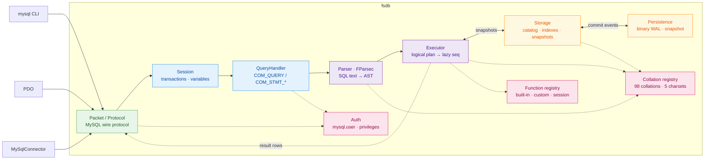

# fsdb

[](LICENSE)
[](global.json)
[](docs/compatibility.md)

A MySQL-compatible database server in idiomatic F#. It speaks the MySQL wire
protocol, so clients such as `mysql`, PDO, and MySqlConnector connect without
an fsdb-specific adapter. Internally, a query follows one readable pipeline:
bytes → command → AST → logical plan → lazy `seq`.

MySQL 8.4 is the compatibility oracle; SQLite is not. Readable F# is the
primary design constraint, ahead of raw performance. The default server is
in-memory, with an opt-in binary WAL and snapshots for durable use.

## Contents

- [Quick start](#quick-start)
- [Configuration](#configuration)
- [How it works](#how-it-works)
- [SQL surface](#sql-surface)
- [Persistence format](#persistence-format)
- [Embedding & extensibility](#embedding--extensibility)
- [Benchmarking](#benchmarking)
- [Development](#development)
- [Documentation](#documentation)

## Quick start

Requires the .NET 10 SDK pinned by `global.json`. A MySQL client is needed for
the CLI walkthrough below; [`just`](https://github.com/casey/just) is optional
but provides the repository's standard commands.

```sh
dotnet run --project src/Fsdb        # listens on 127.0.0.1:3307
mysql --protocol=tcp -h127.0.0.1 -P3307 -uroot -e 'SELECT 1'
```

With `just`, the same two-terminal workflow is `just run` and `just client`.

Port 3307 avoids a real MySQL on 3306 (`--port` overrides). A `root` account
with all privileges and no password exists out of the box; accounts, `GRANT`s,
and passwords are managed with the usual `CREATE USER` / `GRANT` / `SET
PASSWORD` statements (mysql_native_password, verified at the handshake — a
passwordless account accepts only an empty password, same as MySQL). Account
locks, TLS requirements, explicit password expiry, per-account resource
limits, and JSON attributes/comments are enforced as well.

First queries:

```sql
CREATE DATABASE app;
USE app;
CREATE TABLE notes (id BIGINT AUTO_INCREMENT PRIMARY KEY, body TEXT);
INSERT INTO notes (body) VALUES ('hello fsdb');
SELECT * FROM notes;
```

Common MySQL clients connect without an fsdb-specific driver:

| Client | Connect |
|---|---|
| mysql CLI | `mysql --protocol=tcp -h127.0.0.1 -P3307 -uroot` |
| PDO (PHP) | `new PDO('mysql:host=127.0.0.1;port=3307;dbname=app', 'root', '')` |
| MySqlConnector (.NET) | `new MySqlConnection("Server=127.0.0.1;Port=3307;User ID=root;Database=app")` |

Install as a single self-contained binary (no .NET needed on the machine):

```sh
just install      # publishes to ~/.local/bin/fsdb, then: fsdb --help
```

```
USAGE: fsdb [--help] [--port <port>] [--listen <address>] [--data-dir <path>]
            [--defaults-file <path>] [--ssl-cert <path>] [--ssl-key <path>]
            [--ssl-ca <path>]
            [--require-secure-transport] [--version]

OPTIONS:

    --port, -p <port>     listen port (default 3307)
    --listen <address>    bind address (default 127.0.0.1)
    --data-dir <path>     persist trusted server state here (WAL + snapshots);
                          omit for in-memory
    --defaults-file <path>
                          read server settings from a my.cnf-style file's
                          [mysqld] section
    --ssl-cert <path>     PEM server certificate for TLS
    --ssl-key <path>      PEM private key for TLS
    --ssl-ca <path>       PEM certificate authorities trusted for TLS clients
    --require-secure-transport
                          reject plaintext MySQL sessions
    --version             print the fsdb version and exit
    --help                display this list of options.
```

## Configuration

fsdb reads `/etc/my.cnf`, `/etc/mysql/my.cnf`, `$MYSQL_HOME/my.cnf`, and
`~/.my.cnf` when present. `--defaults-file` reads only the named file instead.
The parser follows MySQL's format rather than a generic ini dialect:
`[mysqld]`/`[server]` groups, mid-line `#`/`;` comments, quoted values with
escapes, `-` and `_` interchangeable, size suffixes, `!include`/`!includedir`,
and `loose-` for options fsdb doesn't have. Other groups are skipped, so a
shared my.cnf is safe to use; an unrecognised option inside `[mysqld]` is a
startup error naming the file and line, the same way mysqld refuses to start
on one.

```ini
[mysqld]
max_connections          = 2000
max_prepared_stmt_count  = 16382
max_allowed_packet       = 64M
default_password_lifetime = 0
default_week_format       = 0
local_infile             = OFF
max_load_data_bytes      = 64M
wait_timeout             = 600
net_read_timeout         = 30
net_write_timeout        = 60
innodb_lock_wait_timeout = 50
cte_max_recursion_depth  = 1000
loose-skip-name-resolve            # an option fsdb has no knob for
ssl-cert                 = /etc/fsdb/server-cert.pem
ssl-key                  = /etc/fsdb/server-key.pem
ssl-ca                   = /etc/fsdb/client-ca.pem
require-secure-transport = ON
```

Defaults-file settings apply at startup as process-wide defaults. The standard
files are auto-discovered unless `--defaults-file` selects one explicitly.
`max_connections`, `max_prepared_stmt_count`, `max_allowed_packet`,
`local_infile`, `wait_timeout`, `interactive_timeout`, `net_read_timeout`, `net_write_timeout`,
`innodb_lock_wait_timeout`, and `cte_max_recursion_depth` can also be changed
with `SET GLOBAL`. `max_load_data_bytes` and the `wal_*` settings are
configuration-only fsdb limits rather than MySQL system variables. See
[the compatibility guide](docs/compatibility.md) for the complete behavior and
deliberate divergences.

## How it works

One pipeline, all the way down:



### Parser

An FParsec combinator grammar parses SQL into a discriminated-union AST.
`SELECT`s compile to a logical plan that executes lazily: `LIMIT` stops the
scan once enough rows survive, and `ORDER BY ... LIMIT n` streams a bounded
top-(n+offset) set instead of materializing the full sort.

### Engine

#### Transactions

Databases and tables live in a value-swapped catalog. Repeatable-read
transactions establish a snapshot on their first database statement;
read-committed transactions refresh from committed roots per statement;
read-uncommitted transactions additionally compose active private deltas into
that statement view. Writes remain private until commit under every isolation
level. Commit performs a row-level three-way merge: disjoint
concurrent changes combine, while indexed point/range UPDATE and DELETE
statements wait for an existing row owner and rebase before applying their
change. Remaining overlapping write shapes fail with MySQL's retryable 1205
error. Immutable row pages let the merge inspect only pages changed from the
transaction snapshot and maintain indexes incrementally.

#### Locks

`FOR UPDATE`, `FOR SHARE`, and `LOCK IN SHARE MODE` use current committed row
versions and retain shared or exclusive row-stripe ownership until transaction
end. `OF`, `NOWAIT`, and `SKIP LOCKED` follow MySQL's transaction behavior;
direct indexed single-table predicates narrow the locked rows, while joins and
scan-shaped locking reads conservatively lock each targeted physical source.
`LOCK TABLES` provides session-scoped shared/exclusive ownership with MySQL's
alias restrictions, temporary-table exception, atomic replacement lists, and
implicit locks for view and trigger dependencies. Ordinary statements acquire
compatible table ownership only for their execution, so explicit locks also
coordinate with sessions that never issue `LOCK TABLES`.

#### Indexes and joins

PK/UNIQUE and composite secondary equality lookups go through maps keyed by
the columns' collation-folded encodings, so `utf8mb4_0900_ai_ci` keys collide
exactly as MySQL's do. Scalar and composite-row literal `IN` lists, along with
direct literal ranges in single-table reads and writes, can seek matching
primary, unique, and secondary B-trees and report `range` in `EXPLAIN`.
`ORDER BY` and compatible `GROUP BY` operations can stream a
whole-column left prefix of a composite index, or a suffix whose preceding
keys are fixed by literal equalities, including `LIMIT`, `OFFSET`, and literal
bounds. Composite keys can include `LOWER(column)` or `UPPER(column)` parts
for matching ordering and grouping prefixes, including a functional suffix
after stored keys fixed by literal equalities. Other expression orderings and
full-value ordering through a prefix key still sort. Equality buckets and
ordered entries are separate derived structures, deliberately trading memory
and write work for efficient equality buckets and bounded range seeks.
Equi-joins use a hash join. A physical inner, left, or right join can instead
probe an index when the rows already in scope bind its complete key, including
joins expressed with `USING` or `NATURAL JOIN`.

### Collations & charsets

All 89 utf8mb4 collations MySQL 8.4 ships are registered — plus the legacy
`utf8mb3`/`latin1`/`ascii`/`binary` ones (`utf8_*` accepted as MySQL's
deprecated alias), 98 in all — each as a locale, fold level, and pad
attribute with ICU sort keys doing the work. Honored per-column and per
`SET collation_connection` in grouping, dedup, joins, and unique keys.
Charsets `utf8mb4`/`utf8mb3`/`latin1` (cp1252)/`ascii`/`binary` follow
MySQL's write-time semantics, with `CONVERT(x USING …)` and `_charset'…'`
introducers.

### Prepared statements

`COM_STMT_PREPARE`/`COM_STMT_EXECUTE` bind parameter `Value`s into the
parsed AST (`?` → `Placeholder` → `Lit`), so a bound value keeps its real
type for every statement the grammar parses; only the text-probed `SET`/
`SHOW` forms still re-splice literals. Forward-only prepared cursors and zlib
protocol compression are supported as well.

## SQL surface

The implemented surface targets statements used by MySQL-backed
applications:

- Queries: joins including `NATURAL`/`USING`, derived and lateral tables,
  `GROUP BY`/`HAVING`, window functions, `UNION [ALL]`, expression subqueries,
  ordinary and recursive CTEs, JSON paths, and `JSON_TABLE`.
- Writes and schema: `INSERT`, `INSERT ... SELECT`, `REPLACE`, multi-table
  `UPDATE`/`DELETE`, generated columns, foreign keys, HASH partition metadata,
  foreign-server catalog DDL, `EXPLAIN`, and enforced or `NOT ENFORCED`
  `CHECK` constraints.
- Stored objects: views and `WITH CHECK OPTION`, procedures, functions,
  scheduled events, and `BEFORE`/`AFTER` triggers with compound bodies and
  nested procedure calls.
- Accounts: `CREATE USER`, roles, `GRANT`/`REVOKE`, password, resource, and
  attribute policy, plus database-, table-, and column-level privilege enforcement.
- Bulk and batched work: `CLIENT_MULTI_STATEMENTS`/`CLIENT_MULTI_RESULTS` and
  client-side `LOAD DATA LOCAL INFILE`, including target columns, user
  variables, and ordered `SET` transformations. Local infile is disabled by
  default and bounded by `max_load_data_bytes`.

The introspection surface GUI clients lean on has compatible schemas and live
data wherever fsdb owns the underlying subsystem: 71 `information_schema`
tables whose column sets are diffed against a live
MySQL 8.4, the `SHOW` family (`STATUS`, `VARIABLES`, `ENGINES`, `GRANTS`,
`CREATE TABLE`, ...), and a live `PROCESSLIST` with working
`KILL QUERY|CONNECTION`.

What makes the SQL surface *this* server's rather than generic SQL: every
comparison, sort, group, dedup, join, and unique key folds by the column's
own collation. `SET collation_connection` governs literals, so
`SELECT 'åge' = 'age' COLLATE utf8mb4_bin` is 0 while
`... COLLATE utf8mb4_0900_ai_ci` is 1. Charsets transcode on write;
`SHOW CREATE TABLE` reports declared collations and column comments, and
`information_schema.COLUMNS` carries `CHARACTER_SET_NAME`, `COLLATION_NAME`,
and `COLUMN_COMMENT`.

The deliberate gaps — including complex updatable views, replication, and
every smaller divergence — are
documented in
[docs/compatibility.md](docs/compatibility.md) and marked `ponytail:` at
their code sites.

## Persistence format

`--data-dir` stores two files, both binary (no JSON). Durable mode currently
targets macOS and Linux because disk synchronization calls POSIX `fsync`
through libc.

The data directory is a trusted input with the same authority as the server
process. CRC-32 detects torn or accidentally corrupted records; it does not
authenticate them. Anyone who can modify `wal.bin` or `snapshot.fsdb` can
modify the catalog, including the `mysql.user` rows loaded at startup. Keep
the directory writable only by the account running fsdb.

**`wal.bin`** — one framed record per committed event:

```
[int32 LE payload length][uint32 LE CRC-32 of payload][payload bytes]
```

The payload is a `CommitEvent` in a tag-byte codec (schema DDL as
pre-encoded statement trees; row events as physical `Value[]`s, so replay
writes the exact committed values — `NOW()` replays to the same instant, not
a fresh one). A crash mid-append leaves a torn final record; replay stops
before it (length overrun or CRC mismatch), truncates the WAL back to the
last good offset, and the next append glues onto a clean boundary.
Replay locates keyed row changes through the table's unique indexes and
maintains derived indexes incrementally; keyless row-image events use one
ordered table pass.

Concurrent commits use a bounded group-commit queue. Commits that arrive
while a flush is in progress share the next append and `fsync`, while each
client is acknowledged only after that batch is durable. Snapshot rotation
passes through the same queue as a checkpoint barrier, so truncation cannot
overtake a published WAL event. The defaults-file setting
`wal_group_commit_queue_capacity` controls producer backpressure (default
1024).

**`snapshot.fsdb`** — the catalog as a self-delimiting binary tree
(`database count` → tables → rows), same tag-byte codec and row format as the
WAL. Written to `snapshot.fsdb.new`, fsynced via libc `fsync`, then renamed
into place; a `.new` that parses cleanly supersedes the WAL on startup, a
torn one falls back to the old snapshot plus full WAL replay. fsdb avoids
`FileStream.Flush(true)` because it issues the substantially stronger
`F_FULLFSYNC` on macOS; plain `fsync` matches MySQL's default macOS flush
semantics.

By default, the catalog is snapshotted and the WAL truncated once the WAL
crosses 64 MiB or 100,000 events, or during a graceful shutdown. The
`wal_rotate_bytes` and `wal_rotate_entries` defaults-file settings tune those
thresholds.

## Embedding & extensibility

The [`Fsdb.Db` facade](src/Fsdb/Db.fs) owns an engine instance, its extension
registry, and its transport settings. Register extensions before opening
connections or serving traffic.

| API | Purpose |
|---|---|
| `Db.registerScalar` | Add a context-free scalar function. |
| `Db.registerAggregate` | Fold one SQL expression over a group. |
| `Db.registerFunction` | Add a context-aware scalar with execution metadata. |
| `Db.registerTable` | Expose host data as a read-only table in the `fsdb` schema. |
| `Db.onCommit` | Subscribe to committed row and schema changes. |
| `Db.connect` | Open a stateful in-process SQL session without a socket. |
| `Db.serve` | Start a background, stoppable MySQL listener. |
| `Db.listen` | Run a MySQL listener until its returned `Async` stops. |

### Create an embedded host

Inside this checkout, create an F# console project and reference fsdb:

```sh
dotnet new console --language F# --framework net10.0 --output examples/MyHost
dotnet add examples/MyHost/MyHost.fsproj reference src/Fsdb/Fsdb.fsproj
```

This complete `Program.fs` registers `SLUGIFY` and starts a listener on an
available local port:

```fsharp
module MyHost.Program

open System
open System.Net
open System.Text.RegularExpressions
open Fsdb
open Fsdb.Functions
open Fsdb.Value

let slugify =
    function
    | [ VNull ] -> VNull
    | [ VString text ] ->
        Regex.Replace(text.ToLowerInvariant(), "[^a-z0-9]+", "-")
        |> fun slug -> slug.Trim '-'
        |> VString
    | _ -> raise (SqlError(1582, "slugify expects one string"))

[<EntryPoint>]
let main _ =
    let db = Db.create () |> Db.registerScalar "SLUGIFY" slugify

    use server = db |> Db.serve IPAddress.Loopback 0
    printfn "fsdb listening on 127.0.0.1:%d" server.Port
    Console.ReadLine() |> ignore
    0
```

Function names are case-insensitive. A host registration can override a
built-in, while session-bound functions such as `DATABASE()` and
`CURRENT_USER()` retain precedence. Arguments and results use the
[`Value` discriminated union](src/Fsdb/Sql/Value.fs), so extensions keep SQL
types instead of receiving preformatted strings.

Arity is expressed by pattern matching, not by registration metadata. Handle
`VNull` explicitly: fsdb evaluates expressions against an all-NULL probe row
before scanning real rows, and SQL functions normally propagate NULL where
appropriate. Raise `SqlError(code, message)` for a deliberate client-visible
failure; any other exception becomes error 1105. An exception from an
extension aborts the current transaction.

The remaining snippets use the same `Fsdb`, `Fsdb.Functions`, and `Fsdb.Value`
opens as the complete host above.

### Register an aggregate

A custom aggregate takes one SQL expression. It receives the non-NULL value
from every row in the group after `DISTINCT`, when present, has been applied.
The engine returns NULL for an empty group.

```fsharp
let median (values: Value list) =
    let sorted =
        values
        |> List.choose (function
            | VInt value -> Some(float value)
            | VDouble value -> Some value
            | _ -> None)
        |> List.sort

    match sorted with
    | [] -> VNull
    | values ->
        let middle = values.Length / 2

        if values.Length % 2 = 0 then
            VDouble((values.[middle - 1] + values.[middle]) / 2.0)
        else
            VDouble values.[middle]

let db =
    Db.create ()
    |> Db.registerAggregate "MEDIAN" median

let connection = Db.connect db
connection.Query "CREATE TABLE scores (score INT)" |> ignore
connection.Query "INSERT INTO scores VALUES (1), (9), (3), (2)" |> ignore

match connection.Query "SELECT MEDIAN(score) AS median FROM scores" with
| Executor.ResultSet([ "median" ], [ [ Some value ] ]) -> printfn "median = %s" value
| Executor.Err(code, message) -> failwithf "query failed (%d): %s" code message
| result -> failwithf "unexpected result: %A" result
```

The wire-level integration test in
[`IntegrationTests.fs`](tests/Fsdb.Tests/IntegrationTests.fs) exercises both
`SLUGIFY` and `MEDIAN` through a real MySqlConnector client.

### Use query context and cancellation

`Db.registerFunction` supplies a `QueryContext` for extensions that depend on
the current session or perform external work:

- `Database` is the current schema and agrees with `DATABASE()`.
- `User` is the authenticated account name, without the host part displayed by
  `CURRENT_USER()`.
- `Cancellation` is signalled when the client disconnects, cancels, or is
  killed. Pass it into blocking I/O.

`ScalarFunction.create` produces a deterministic function that is allowed in
stored expressions. `ScalarFunction.effectful` marks it non-deterministic and
direct-only. Direct-only functions are rejected where fsdb would invoke them
indirectly later, including generated columns, functional defaults and indexes,
CHECK constraints, and trigger bodies.

`ScalarFunction.withSignature` declares SQL parameter and result types for
prepared-statement metadata. Unsigned integers, JSON, temporal, spatial, and
binary types therefore reach clients without being reported as generic strings:

```fsharp
open System.Net.Http
open Fsdb.Ast

let http = new HttpClient()

let httpGet (context: QueryContext) =
    function
    | [ VNull ] -> VNull
    | [ VString url ] ->
        try
            http.GetStringAsync(url, context.Cancellation)
                .GetAwaiter()
                .GetResult()
            |> VString
        with
        | :? OperationCanceledException -> reraise ()
        | error -> raise (SqlError(1296, sprintf "HTTP request failed: %s" error.Message))
    | _ -> raise (SqlError(1582, "http_get expects one URL"))

let db =
    Db.create ()
    |> Db.registerFunction (
        ScalarFunction.create "HTTP_GET" httpGet
        |> ScalarFunction.withSignature [ TVarchar 2048 ] TJson
        |> ScalarFunction.effectful)
```

Scalar execution is synchronous. A slow HTTP call blocks its connection's
query, so cancellation and host-side timeouts still matter.

### Expose host data as a virtual table

Virtual tables are read-only overlays in the reserved `fsdb` schema. Their row
provider runs once per referencing statement before SQL filtering, so it
should return a bounded snapshot rather than an unbounded stream.

```fsharp
let models =
    [ "embed", "http://localhost:11434/v1", "nomic-embed-text"
      "chat", "http://localhost:11434/v1", "llama3.2" ]

let modelTable =
    VirtualTable.create
        "models"
        [ VirtualTable.text "alias"
          VirtualTable.text "endpoint"
          VirtualTable.text "model" ]
        (fun () ->
            [ for alias, endpoint, model in models ->
                  [| VString alias; VString endpoint; VString model |] ])

let db =
    Db.create ()
    |> Db.registerTable modelTable

let connection = Db.connect db
connection.Query "SELECT alias, model FROM fsdb.models ORDER BY alias" |> ignore
```

The provider must return one `Value` per declared column. Re-registering a
name replaces it case-insensitively, and a virtual table shadows a physical
table with the same name. `VirtualTable.text`, `int`, `bigint`, and `double`
create nullable columns with the server defaults; other types can use an
`Ast.ColumnDef`. Writes to the virtual table are rejected. Call `registerTable`
after `withDataDir`, because `withDataDir` replaces the store.

### Consume committed changes

`Db.onCommit` is a multi-subscriber change feed over the same physical events
used by persistence. Inserts contain stored rows after defaults, coercion, and
auto-increment assignment; updates contain `(before, after)` pairs; deletes
contain removed rows. Explicit transactions arrive as one
`TransactionCommitted` event. Failed statements and rollbacks emit nothing.

```fsharp
open System.Collections.Concurrent

let committed = ConcurrentQueue<Storage.CommitEvent>()

let db =
    Db.create ()
    |> Db.withDataDir "./fsdb-data"
    |> Db.onCommit (fun event -> committed.Enqueue event)

let rec insertedDocs =
    function
    | Storage.RowsInserted("fsdb", "docs", rows) -> rows
    | Storage.TransactionCommitted events -> events |> List.collect insertedDocs
    | _ -> []

let drain () =
    let mutable event = Unchecked.defaultof<Storage.CommitEvent>

    while committed.TryDequeue &event do
        for row in insertedDocs event do
            printfn "committed doc row: %A" row
```

Handlers run synchronously under the commit-ordering lock. Keep them fast,
avoid blocking, and never write back to the database from a handler; re-entry
deadlocks. Queue events and process them after the originating statement
returns. A thrown handler exception can make that statement report an error,
but cannot roll back data that has already been published, so handlers should
capture their own failures.

### Run SQL in-process or over the wire

`Db.connect` creates a stateful session without a socket. The selected
database, variables, temporary tables, and open transaction persist between
`Query` calls:

```fsharp
let connection = Db.connect db
connection.Query "USE app" |> ignore
connection.Query "SET @request_id = 'abc-123'" |> ignore

match connection.Query "SELECT @request_id" with
| Executor.ResultSet(columns, rows) -> printfn "%A %A" columns rows
| Executor.Affected count -> printfn "%d rows affected" count
| Executor.Err(code, message) -> eprintfn "ERR %d: %s" code message
| Executor.MultipleResults results -> printfn "%d results" results.Length
```

`Db.serve` starts a background server and returns the actual bound port plus a
stop function. `Db.listen` returns a foreground `Async<unit>` instead:

```fsharp
use server = db |> Db.serve System.Net.IPAddress.Loopback 0
printfn "listening on %d" server.Port

Db.create ()
|> Db.listen System.Net.IPAddress.Loopback 3307
|> Async.RunSynchronously
```

Durability, logging, and TLS are builder-style options too. Configure the
store before registering virtual tables or commit subscribers:

```fsharp
let db =
    Db.create ()
    |> Db.withDataDir "./fsdb-data"
    |> Db.withLogger (fun message -> printfn "[fsdb] %s" message)
    |> Db.withTlsCertificate certificate
    |> Db.withClientCertificateAuthority clientCa
    |> Db.requireSecureTransport
```

The logger is process-global. The TLS server certificate must be an
`X509Certificate2` that contains its private key. Client certificate
authorities are public certificates used to validate accounts marked
`REQUIRE X509`.

### Included examples

[`examples/LlmSearch`](examples/LlmSearch/Program.fs) registers cancellable
`llm_complete` and `llm_embed` functions for an OpenAI-compatible endpoint,
exposes a `fsdb.models` virtual table, queues inserted documents with
`onCommit`, and runs semantic search with `DISTANCE(..., 'COSINE')`:

```sh
just example -- --dry-run
```

[`examples/ReceiptPipeline`](examples/ReceiptPipeline/Program.fs) registers
`ocr` and `llm_schema`, then uses SQL for batching, extraction, upserts,
deduplication, `JSON_TABLE`, constraints, views, and chained audit triggers:

```sh
just receipts -- --dry-run

RECEIPT_ENDPOINT=https://api.openai.com/v1 \
RECEIPT_MODEL=gpt-5-mini RECEIPT_API_KEY=$OPENAI_API_KEY \
  just receipts -- --dump ~/receipts/*.pdf
```

The receipt schema constrains model-produced dates and numeric ranges before
they reach relational tables. A unique file hash prevents repeated OCR and
model calls for identical bytes, while relational unique keys catch rescans
whose bytes differ but extracted identity is the same.

## Benchmarking

`benchmarks/Fsdb.Benchmarks` runs fsdb head-to-head against a native MySQL
8.4, same schema, same seeded data, same queries, via BenchmarkDotNet.

```sh
just bench              # full latency suite, results -> benchmarks/results/<git-sha>.md
just bench-features     # recent SQL-feature latency subset
just bench-quick        # ShortRun job for fast local iteration, no results file
just bench-durable      # durability-matched: fsdb WAL vs MySQL fsync/no-fsync
just bench-scale        # latency suite at 100k users / 500k orders
just bench-load         # N-writer throughput under concurrency (ops/sec)
just bench-load-scale   # throughput at 1/2/4/8/16 workers
just bench-comprehensive # all latency, durability, scale, and load suites
```

Both servers start ad hoc (no brew services) and shut down after. fsdb
optimizes for readable, idiomatic F# over raw speed, so expect MySQL to win
most of these — the numbers track fsdb's hotspots, not parity.

## Development

Run the normal local gate before sending a change:

```sh
just check
```

That builds the root solution and runs the full Expecto suite. The `test`
recipe passes additional arguments through to Expecto, so one case can be run
by name:

```sh
just test --filter-test-case <Substring>
```

`just test-report` writes JUnit timings to `test-results/fsdb.xml`, and
`just stress [minutes]` runs Expecto's randomized stress mode with a 6 GiB
memory guard for repeated large-packet and snapshot cases.

Coverage uses the repository-pinned Coverlet tool and fails if total branch
coverage falls below 65%:

```sh
just coverage
```

F# source order is explicit. When adding a `.fs` file, place its
`<Compile Include="..." />` entry in dependency order in the relevant project
file before any file that consumes it.

MySQL 8.4 is the semantic oracle. Compatibility changes should be checked
against MySQL rather than SQLite, then captured in the Expecto suite. The
differential harness under `torture/` is a separate solution and deliberately
is not part of `just check`; see the
[torture harness guide](torture/README.md) before running or changing it.

## Documentation

- [Compatibility](docs/compatibility.md) — how MySQL 8.4 equivalence is validated
- [Comment style](docs/comment-style.md) — the grading every comment survives
- [Torture harness](torture/README.md) — differential fuzzing against a MySQL 8.4 oracle
- [Benchmarks](benchmarks/README.md) — workloads and methodology
