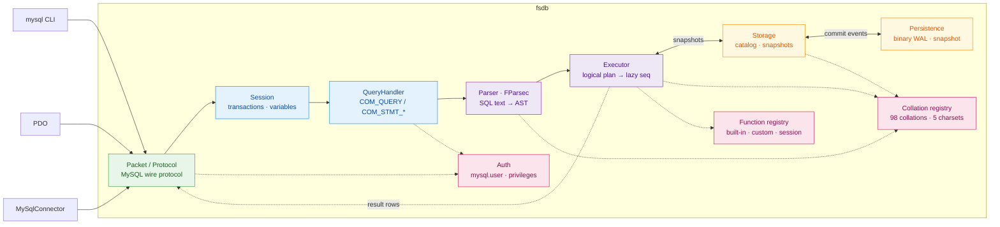

# fsdb

[](LICENSE)
[](global.json)
[](docs/compatibility.md)

A MySQL-compatible database server in idiomatic F#. It speaks the MySQL wire
protocol, so `mysql`, PDO, or any MySQL driver works against it unchanged —
over an in-memory engine built as a pipeline of discriminated unions.

Readable F# is the primary goal; raw performance is not.

Not a production database: no TLS or replication — a single-node engine for
learning, embedding, testing, and local tooling. For production workloads use
MySQL, PostgreSQL, or SQLite.

## Contents

- [Quick start](#quick-start)
- [How it works](#how-it-works)
- [SQL surface](#sql-surface)
- [Persistence format](#persistence-format)
- [Embedding & extensibility](#embedding--extensibility)
- [Benchmarking](#benchmarking)
- [Documentation](#documentation)

## Quick start

Needs the .NET 10 SDK (pinned by `global.json`) and a MySQL client; `just` is
optional.

```sh
dotnet run --project src/Fsdb        # listens on 127.0.0.1:3307
mysql --protocol=tcp -h127.0.0.1 -P3307 -e 'SELECT 1'
```

Port 3307 avoids a real MySQL on 3306 (`--port` overrides). A `root` account
with all privileges and no password exists out of the box; accounts, `GRANT`s,
and passwords are managed with the usual `CREATE USER` / `GRANT` / `SET
PASSWORD` statements (mysql_native_password, verified at the handshake — a
passwordless account accepts only an empty password, same as MySQL).

First queries:

```sql
CREATE DATABASE app;
USE app;
CREATE TABLE notes (id BIGINT AUTO_INCREMENT PRIMARY KEY, body TEXT);
INSERT INTO notes (body) VALUES ('hello fsdb');
SELECT * FROM notes;
```

Any MySQL client works unchanged:

| Client | Connect |
|---|---|
| mysql CLI | `mysql --protocol=tcp -h127.0.0.1 -P3307 -uroot` |
| PDO (PHP) | `new PDO('mysql:host=127.0.0.1;port=3307;dbname=app', 'root', '')` |
| MySqlConnector (.NET) | `new MySqlConnection("Server=127.0.0.1;Port=3307;User ID=root;Database=app")` |

Install as a single self-contained binary (no .NET needed on the machine):

```sh
just install      # publishes to ~/.local/bin/fsdb, then: fsdb --help
```

```
USAGE: fsdb [--help] [--port <port>] [--listen <address>] [--data-dir <path>]
            [--version]

OPTIONS:

    --port, -p <port>     listen port (default 3307)
    --listen <address>    bind address (default 127.0.0.1)
    --data-dir <path>     persist data here (WAL + snapshots); omit for
                          in-memory
    --version             print the fsdb version and exit
    --help                display this list of options.
```

## How it works

One pipeline, all the way down:



### Parser

An FParsec combinator grammar parses SQL into a discriminated-union AST.
`SELECT`s compile to a logical plan that executes lazily: `LIMIT` stops the
scan once enough rows survive, and `ORDER BY ... LIMIT n` streams a bounded
top-(n+offset) set instead of materializing the full sort.

### Engine

Databases and tables live in a value-swapped catalog. Every write produces an
immutable snapshot, which is what makes transactions (`BEGIN`/`COMMIT`/
`ROLLBACK`) free: each snapshot is a consistent view. PK/UNIQUE lookups go
through a map keyed by each column's collation-folded encoding, so
`utf8mb4_0900_ai_ci` keys collide exactly as MySQL's do. Equi-joins
hash-join; everything else is a scan.

### Collations & charsets

All 89 utf8mb4 collations MySQL 8.4 ships are registered — plus the legacy
`utf8mb3`/`latin1`/`ascii`/`binary` ones (`utf8_*` accepted as MySQL's
deprecated alias), 98 in all — each as a locale, fold level, and pad
attribute with ICU sort keys doing the work. Honored per-column and per
`SET collation_connection` in grouping, dedup, joins, and unique keys.
Charsets `utf8mb4`/`utf8mb3`/`latin1` (cp1252)/`ascii`/`binary` follow
MySQL's write-time semantics, with `CONVERT(x USING …)` and `_charset'…'`
introducers.

### Prepared statements

`COM_STMT_PREPARE`/`COM_STMT_EXECUTE` bind parameter `Value`s into the
parsed AST (`?` → `Placeholder` → `Lit`), so a bound value keeps its real
type for every statement the grammar parses; only the text-probed `SET`/
`SHOW` forms still re-splice literals.

## SQL surface

The grammar covers what MySQL-backed applications use: `SELECT` with joins
(`NATURAL`/`USING` included), derived tables, `GROUP BY`/`HAVING`, window
functions, `UNION [ALL]`, CTE-free subqueries in expressions, JSON paths,
multi-table `UPDATE`/`DELETE`, `EXPLAIN`, and user accounts with real
`CREATE USER`/`GRANT`/`REVOKE` privilege enforcement.

The introspection surface GUI clients lean on is served with real data:
22 `information_schema` tables whose column sets are diffed against a live
MySQL 8.4, the `SHOW` family (`STATUS`, `VARIABLES`, `ENGINES`, `GRANTS`,
`CREATE TABLE`, ...), and a live `PROCESSLIST` with working
`KILL QUERY|CONNECTION`.

What makes the SQL surface *this* server's rather than generic SQL: every
comparison, sort, group, dedup, join, and unique key folds by the column's
own collation. `SET collation_connection` governs literals, so
`SELECT 'åge' = 'age' COLLATE utf8mb4_bin` is 0 while
`... COLLATE utf8mb4_0900_ai_ci` is 1. Charsets transcode on write;
`SHOW CREATE TABLE` reports declared collations, and
`information_schema.COLUMNS` carries `CHARACTER_SET_NAME`/`COLLATION_NAME`.

The deliberate gaps — no CTEs, views, stored routines, triggers, or events —
and every smaller divergence are documented in
[docs/compatibility.md](docs/compatibility.md) and marked `ponytail:` at
their code sites.

## Persistence format

`--data-dir` stores two files, both binary (no JSON):

**`wal.bin`** — one framed record per committed event:

```
[int32 LE payload length][uint32 LE CRC-32 of payload][payload bytes]
```

The payload is a `CommitEvent` in a tag-byte codec (schema DDL as
pre-encoded statement trees; row events as physical `Value[]`s, so replay
writes the exact committed values — `NOW()` replays to the same instant, not
a fresh one). A crash mid-append leaves a torn final record; replay stops
before it (length overrun or CRC mismatch), truncates the WAL back to the
last good offset, and the next append glues onto a clean boundary. Once the
WAL crosses 64 MiB or 100k events — or on SIGTERM/SIGINT — the whole catalog
is snapshotted and the WAL truncates.

**`snapshot.fsdb`** — the catalog as a self-delimiting binary tree
(`database count` → tables → rows), same tag-byte codec and row format as the
WAL. Written to `snapshot.fsdb.new`, fsynced via libc `fsync`, then renamed
into place; a `.new` that parses cleanly supersedes the WAL on startup, a
torn one falls back to the old snapshot plus full WAL replay. Nothing is
written with `FileStream.Flush(true)` (macOS `F_FULLFSYNC` — ~5 ms per call);
the plain `fsync` matches MySQL's own macOS durability semantics.

## Embedding & extensibility

Every function call — including built-ins like `CONCAT` and `JSON_EXTRACT` —
resolves through one registry, SQLite-style. Embed fsdb in your own program and
register a function before you start listening:

```fsharp
open Fsdb
open Fsdb.Value

let slug (s: string) =
    System.Text.RegularExpressions.Regex.Replace(s.ToLowerInvariant(), "[^a-z0-9]+", "-").Trim '-'

[<EntryPoint>]
let main _ =
    Db.create ()
    |> Db.registerScalar "slugify" (function
        | [ VString s ] -> VString(slug s)
        | _ -> VNull)
    |> Db.listen System.Net.IPAddress.Loopback 3307
    |> Async.RunSynchronously

    0
```

`Db.registerAggregate` works the same way for aggregate functions — the fold
receives every non-NULL row's value and returns one:

```fsharp
let median (values: Value list) =
    let sorted = values |> List.choose (function VInt i -> Some(float i) | _ -> None) |> List.sort

    match sorted with
    | [] -> VNull
    | _ ->
        let mid = sorted.Length / 2

        if sorted.Length % 2 = 0 then
            VDouble((sorted.[mid - 1] + sorted.[mid]) / 2.0)
        else
            VDouble sorted.[mid]

let db =
    Db.create ()
    |> Db.registerAggregate "MEDIAN" median
```

A custom function can override a built-in of the same name — the registry
doesn't distinguish "shipped with fsdb" from "registered by the embedder",
though session-bound functions like `DATABASE()` always shadow both:

```fsharp
// Deterministic timestamps for reproducible tests.
Db.create ()
|> Db.registerScalar "NOW" (fun _ -> VDateTime(System.DateTime(2026, 1, 1)))
```

`--data-dir` durability works the same way when embedding:

```fsharp
Db.create () |> Db.withDataDir "./fsdb-data" |> Db.listen System.Net.IPAddress.Loopback 3307
```

`Db.withLogger` hooks a log sink in the same style. See
`tests/Fsdb.Tests/IntegrationTests.fs` for the full round-trip test
(`SLUGIFY`/`MEDIAN`) against a real client over the wire.

### The rich extension API

`registerScalar` is the sugar for context-free functions. A function that
calls the network (or needs to know who's asking) uses the rich form:

```fsharp
Db.create ()
|> Db.registerFunction (
    ScalarFunction.create "LLM_EMBED" (fun ctx args -> embed ctx.Cancellation args)
    |> ScalarFunction.effectful)
```

- **`QueryContext`** — what the function sees about the executing query:
  `Database` (current schema, matches `DATABASE()`), `User` (matches
  `CURRENT_USER()`), and `Cancellation`, the killed-client token — hand it
  to `HttpClient` so a network call stops when its client vanishes.
- **`ScalarFunction.create name fn`** builds the default shape:
  deterministic, callable anywhere. **`ScalarFunction.effectful`** is the
  network-calling shape in one word: non-deterministic plus direct-only.
  Direct-only functions are rejected inside generated-column definitions
  (SQLite's DIRECTONLY rationale: the engine — not the user's statement —
  would re-invoke them on every later write); the deterministic flag is
  carried metadata for host-side caches.
- **`SqlError`** — `raise (SqlError(1210, "no such model"))` reaches the
  client as exactly that code/message instead of the generic 1105
  catch-all. A throwing function still aborts the transaction like any
  other failure.
- **Arity is a pattern match**, not a registration parameter — one function
  handles all its shapes: `function [p] -> ... | [m; p] -> ... | _ -> raise ...`.
  Handle `VNull` arguments too: the executor type-checks expressions
  against an all-NULL probe row before touching real rows, so return
  `VNull` for NULL inputs like every builtin does.
- **Blocking, honestly**: there is no async executor. A scalar blocks its
  connection thread for as long as it runs — a slow HTTP call is a slow
  query, on that connection only.

`Db.registerTable` exposes host state as a read-only table in the reserved
`fsdb` schema, and `Db.onCommit` subscribes to the committed-write feed
(the same CDC feed the WAL rides, multi-subscriber):

```fsharp
db
|> Db.registerTable (
    VirtualTable.create "models" [ VirtualTable.text "name"; VirtualTable.text "endpoint" ] listModels)
|> Db.onCommit (fun event -> queue.Enqueue event)
```

The `onCommit` contract: handlers run synchronously under the commit lock,
so keep them fast, and never write back into the database from inside one —
re-entry deadlocks. Queue what you saw and act after the statement returns
(see the auto-embedding loop in the example below). Subscribe after
`withDataDir`, which replaces the store.

`Db.connect` opens an in-process connection (no socket — `USE`, variables,
and transactions persist across `Query` calls), and `Db.serve` starts a
stoppable wire server (`RunningServer.Port` matters when you pass port 0):

```fsharp
let conn = Db.connect db
conn.Query "SELECT * FROM fsdb.models" |> ignore

use running = db |> Db.serve System.Net.IPAddress.Loopback 0
printfn "listening on %d" running.Port
```

`examples/LlmSearch` puts all of it together — `llm_complete`/`llm_embed`
against any OpenAI-compatible endpoint (Ollama by default), a `fsdb.models`
virtual table, auto-embedding on insert via `onCommit`, and semantic search
with `ORDER BY DISTANCE(..., 'COSINE')`. Run it without a model server:

```sh
just example -- --dry-run
```

`examples/ReceiptPipeline` goes further: PDFs in, relational rows out, with
the work in SQL rather than host code. The host registers `ocr` (pdftotext)
and `llm_schema` (structured extraction), then six statements do the rest —
two cancellable batch `UPDATE`s, an `INSERT ... SELECT ... ON DUPLICATE KEY
UPDATE` vendor upsert, `INSERT IGNORE` against a unique key as the receipt
dedupe, and `JSON_TABLE` exploding `$.items[*]` into line-item rows. An
`AFTER INSERT` trigger journals each enqueued file.

```sh
just receipts -- --dry-run                       # offline fixtures
RECEIPT_ENDPOINT=https://api.openai.com/v1 \
RECEIPT_MODEL=gpt-5-mini RECEIPT_API_KEY=$OPENAI_API_KEY \
  just receipts -- --dump ~/receipts/*.pdf       # real PDFs, real model
```

Two things that example teaches the hard way. **Constrain formats in the
schema, not the prompt**: without a `"ISO 8601 YYYY-MM-DD"` description on
the date field, a live run returned `25/01/2026` for two receipts, which
doesn't coerce to `DATE` — and `INSERT IGNORE`, being both the dedupe and the
failure sink, dropped them silently. **Dedupe in two layers**: a `UNIQUE` sha
on the queue catches byte-identical resubmissions before spending an LLM
call, while the unique key on `receipts` catches the same receipt arriving as
different bytes. Keying dedupe solely on model output makes it only as stable
as the model.

## Benchmarking

`benchmarks/Fsdb.Benchmarks` runs fsdb head-to-head against a native MySQL
8.4, same schema, same seeded data, same queries, via BenchmarkDotNet.

```sh
just bench         # full latency suite, results -> benchmarks/results/<git-sha>.md
just bench-quick   # ShortRun job for fast local iteration, no results file
just bench-durable # durability-matched: fsdb WAL vs MySQL fsync/no-fsync
just bench-scale   # latency suite at 100k users / 500k orders
just bench-load    # N-writer throughput under concurrency (ops/sec)
```

Both servers start ad hoc (no brew services) and shut down after. fsdb
optimizes for readable, idiomatic F# over raw speed, so expect MySQL to win
most of these — the numbers track fsdb's hotspots, not parity.

## Documentation

- [Compatibility](docs/compatibility.md) — how MySQL 8.4 equivalence is validated
- [Comment style](docs/comment-style.md) — the grading every comment survives
- [Torture harness](torture/README.md) — differential fuzzing against a MySQL 8.4 oracle
- [Benchmarks](benchmarks/README.md) — workloads and methodology

