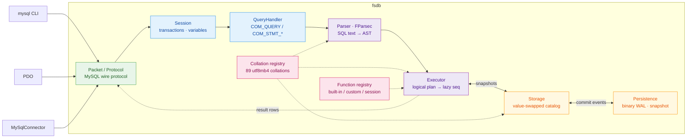

# fsdb

[](LICENSE)
[](global.json)
[](docs/compatibility.md)

A MySQL-compatible database server in idiomatic F#. It speaks the MySQL wire
protocol, so `mysql`, PDO, or any MySQL driver works against it unchanged —
over an in-memory engine built as a pipeline of discriminated unions.

Readable F# is the primary goal; raw performance is not.

Not a production database: no authentication, TLS, or replication — a
single-node engine for learning, embedding, testing, and local tooling. For
production workloads use MySQL, PostgreSQL, or SQLite.

## Contents

- [Quick start](#quick-start)
- [How it works](#how-it-works)
- [SQL surface](#sql-surface)
- [Embedding & extensibility](#embedding--extensibility)
- [Benchmarking](#benchmarking)
- [Documentation](#documentation)

## Quick start

Needs the .NET 10 SDK (pinned by `global.json`) and a MySQL client; `just` is
optional.

```sh
dotnet run --project src/Fsdb        # listens on 127.0.0.1:3307
mysql --protocol=tcp -h127.0.0.1 -P3307 -e 'SELECT 1'
```

Port 3307 avoids a real MySQL on 3306 (`--port` overrides). Any
username/password is accepted, so bind to loopback.

First queries:

```sql
CREATE DATABASE app;
USE app;
CREATE TABLE notes (id BIGINT AUTO_INCREMENT PRIMARY KEY, body TEXT);
INSERT INTO notes (body) VALUES ('hello fsdb');
SELECT * FROM notes;
```

Any MySQL client works unchanged:

| Client | Connect |
|---|---|
| mysql CLI | `mysql --protocol=tcp -h127.0.0.1 -P3307 -uroot` |
| PDO (PHP) | `new PDO('mysql:host=127.0.0.1;port=3307;dbname=app', 'root', '')` |
| MySqlConnector (.NET) | `new MySqlConnection("Server=127.0.0.1;Port=3307;User ID=root;Database=app")` |

Install as a single framework-dependent binary (needs the .NET 10 runtime):

```sh
just install      # publishes to ~/.local/bin/fsdb, then: fsdb --help
```

```
USAGE: fsdb [--help] [--port <port>] [--listen <address>] [--data-dir <path>]
            [--version]

OPTIONS:

    --port, -p <port>     listen port (default 3307)
    --listen <address>    bind address (default 127.0.0.1)
    --data-dir <path>     persist data here (WAL + snapshots); omit for
                          in-memory
    --version             print the fsdb version and exit
    --help                display this list of options.
```

## How it works



- **Parser** — an FParsec combinator grammar over a discriminated-union AST.
  `SELECT`s compile to a logical plan that executes lazily: `LIMIT` stops the
  scan once enough rows survive, and `ORDER BY ... LIMIT n` streams a bounded
  top-(n+offset) set instead of materializing the full sort.
- **Engine** — databases and tables live in a value-swapped catalog; every
  write produces an immutable snapshot, which is what makes transactions
  (`BEGIN`/`COMMIT`/`ROLLBACK`) free: each snapshot is a consistent view.
  PK/UNIQUE lookups go through a map keyed by each column's collation-folded
  encoding — `utf8mb4_0900_ai_ci` keys collide exactly as MySQL's do.
  Equi-joins hash-join; everything else is a scan.
- **Collations & charsets** — all 89 utf8mb4 collations MySQL 8.4 ships, each
  a registry entry of locale, fold level, and pad attribute; ICU sort keys do
  the work. Honored per-column and per `SET collation_connection` in grouping,
  dedup, joins, and unique keys. Charsets `utf8mb4`/`latin1` (cp1252)/
  `ascii`/`binary` follow MySQL's write-time semantics, with
  `CONVERT(x USING …)` and `_charset'…'` introducers.
- **Prepared statements** — `COM_STMT_PREPARE`/`COM_STMT_EXECUTE` bind
  parameter `Value`s into the parsed AST (`?` → `Placeholder` → `Lit`), so a
  bound value keeps its real type for every statement the grammar parses;
  only the text-probed `SET`/`SHOW` forms still re-splice literals.
- **Persistence** — opt-in `--data-dir`: a binary WAL of `[len][crc32]` records
  (the CRC drops a torn final record from a crash mid-append) plus a snapshot,
  fsync'd via libc and replayed on startup. Omit it and everything lives in
  memory.

## SQL surface

```sql
CREATE TABLE users (
  id BIGINT AUTO_INCREMENT PRIMARY KEY,
  name VARCHAR(100) COLLATE utf8mb4_bin,
  tags JSON,
  joined_at DATETIME DEFAULT CURRENT_TIMESTAMP
);

INSERT INTO users (name, tags) VALUES
  ('Ada',   '{"langs": ["fsharp"]}'),
  ('Grace', '{"langs": ["cobol"]}');

-- window functions
SELECT name, ROW_NUMBER() OVER (ORDER BY joined_at) FROM users;

-- JSON paths
SELECT name, JSON_EXTRACT(tags, '$.langs[0]') FROM users;

-- per-column and connection collation
SET collation_connection = utf8mb4_bin;
SELECT 'åge' = 'age';                              -- 0
SELECT 'åge' = 'age' COLLATE utf8mb4_0900_ai_ci;   -- 1

-- joins, derived tables, transactions, EXPLAIN
CREATE TABLE orders (id BIGINT PRIMARY KEY, user_id BIGINT, total INT);
INSERT INTO orders VALUES (1, 1, 50), (2, 1, 150), (3, 2, 300);

BEGIN;
SELECT u.name, COUNT(*) FROM users u
  JOIN (SELECT * FROM orders WHERE total > 100) o ON o.user_id = u.id
  GROUP BY u.name HAVING COUNT(*) > 1;
COMMIT;

EXPLAIN SELECT * FROM users WHERE id = 1;
```

Plus `UNION [ALL]`, `HAVING`, `NATURAL`/`USING` joins, `LAG`, `GROUP_CONCAT`,
information_schema tables, `SHOW CREATE TABLE`, multi-table `UPDATE`/`DELETE`,
and `--data-dir` durability across restarts. Missing SQL surface is tracked in
[docs/ROADMAP.md](docs/ROADMAP.md).

## Embedding & extensibility

Every function call — including built-ins like `CONCAT` and `JSON_EXTRACT` —
resolves through one registry, SQLite-style. Embed fsdb in your own program and
register a function before you start listening:

```fsharp
open Fsdb
open Fsdb.Value

let slug (s: string) =
    System.Text.RegularExpressions.Regex.Replace(s.ToLowerInvariant(), "[^a-z0-9]+", "-").Trim '-'

[<EntryPoint>]
let main _ =
    Db.create ()
    |> Db.registerScalar "slugify" (function
        | [ VString s ] -> VString(slug s)
        | _ -> VNull)
    |> Db.listen System.Net.IPAddress.Loopback 3307
    |> Async.RunSynchronously

    0
```

`Db.registerAggregate` works the same way for aggregate functions — the fold
receives every non-NULL row's value and returns one:

```fsharp
let median (values: Value list) =
    let sorted = values |> List.choose (function VInt i -> Some(float i) | _ -> None) |> List.sort

    match sorted with
    | [] -> VNull
    | _ ->
        let mid = sorted.Length / 2

        if sorted.Length % 2 = 0 then
            VDouble((sorted.[mid - 1] + sorted.[mid]) / 2.0)
        else
            VDouble sorted.[mid]

let db =
    Db.create ()
    |> Db.registerAggregate "MEDIAN" median
```

A custom function can override a built-in of the same name — the registry
doesn't distinguish "shipped with fsdb" from "registered by the embedder",
though session-bound functions like `DATABASE()` always shadow both:

```fsharp
// Deterministic timestamps for reproducible tests.
Db.create ()
|> Db.registerScalar "NOW" (fun _ -> VDateTime(System.DateTime(2026, 1, 1)))
```

`--data-dir` durability works the same way when embedding:

```fsharp
Db.create () |> Db.withDataDir "./fsdb-data" |> Db.listen System.Net.IPAddress.Loopback 3307
```

`Db.withLogger` hooks a log sink in the same style. See
`tests/Fsdb.Tests/IntegrationTests.fs` for the full round-trip test
(`SLUGIFY`/`MEDIAN`) against a real client over the wire.

## Benchmarking

`benchmarks/Fsdb.Benchmarks` runs fsdb head-to-head against a native MySQL
8.4, same schema, same seeded data, same queries, via BenchmarkDotNet.

```sh
just bench         # full latency suite, results -> benchmarks/results/<git-sha>.md
just bench-quick   # ShortRun job for fast local iteration, no results file
just bench-durable # durability-matched: fsdb WAL vs MySQL fsync/no-fsync
just bench-scale   # latency suite at 100k users / 500k orders
just bench-load    # N-writer throughput under concurrency (ops/sec)
```

Both servers start ad hoc (no brew services) and shut down after. fsdb
optimizes for readable, idiomatic F# over raw speed, so expect MySQL to win
most of these — the numbers track fsdb's hotspots, not parity.

## Documentation

- [Compatibility](docs/compatibility.md) — how MySQL 8.4 equivalence is validated
- [Roadmap](docs/ROADMAP.md) — milestone plan, acceptance gates, evidence
- [Comment style](docs/comment-style.md) — the grading every comment survives
- [Torture harness](torture/README.md) — differential fuzzing against a MySQL 8.4 oracle
- [Benchmarks](benchmarks/README.md) — workloads and methodology

## License

MIT — see [LICENSE](LICENSE).
