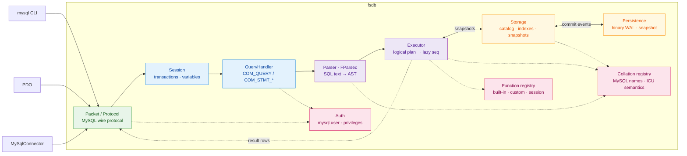

# fsdb

[](LICENSE)
[](global.json)
[](docs/compatibility.md)

A MySQL-compatible database server in idiomatic F#. It speaks the MySQL wire
protocol, so clients such as `mysql`, PDO, and MySqlConnector connect without
an fsdb-specific adapter. Internally, a query follows one readable pipeline:
bytes → command → AST → logical plan → lazy `seq`.

MySQL 8.4 is the compatibility oracle; SQLite is not. Readable F# is the
primary design constraint, ahead of raw performance. The default server is
in-memory, with an opt-in binary WAL and snapshots for durable use.

## Contents

- [Quick start](#quick-start)
- [Configuration](#configuration)
- [How it works](#how-it-works)
- [SQL surface](#sql-surface)
- [Persistence format](#persistence-format)
- [Embedding & extensibility](#embedding--extensibility)
- [Benchmarking](#benchmarking)
- [Development](#development)
- [Documentation](#documentation)

## Quick start

Requires the .NET 10 SDK pinned by `global.json`. A MySQL client is needed for
the CLI walkthrough below; [`just`](https://github.com/casey/just) is optional
but provides the repository's standard commands.

```sh
dotnet run --project src/Fsdb        # listens on 127.0.0.1:3307
mysql --protocol=tcp -h127.0.0.1 -P3307 -uroot -e 'SELECT 1'
```

With `just`, the same two-terminal workflow is `just run` and `just client`.

Port 3307 avoids a real MySQL on 3306 (`--port` overrides). The bootstrap
account is `root` with all privileges and no password. Authentication uses
`mysql_native_password`; a passwordless account accepts only an empty password,
matching MySQL.

Manage accounts and grants with `CREATE USER`, `GRANT`, and `SET PASSWORD`.
Account locks, TLS requirements, explicit password expiry, per-account resource
limits, and JSON attributes and comments are enforced.

First queries:

```sql
CREATE DATABASE app;
USE app;
CREATE TABLE notes (id BIGINT AUTO_INCREMENT PRIMARY KEY, body TEXT);
INSERT INTO notes (body) VALUES ('hello fsdb');
SELECT * FROM notes;
```

Common MySQL clients connect without an fsdb-specific driver:

| Client | Connect |
|---|---|
| mysql CLI | `mysql --protocol=tcp -h127.0.0.1 -P3307 -uroot` |
| PDO (PHP) | `new PDO('mysql:host=127.0.0.1;port=3307;dbname=app', 'root', '')` |
| MySqlConnector (.NET) | `new MySqlConnection("Server=127.0.0.1;Port=3307;User ID=root;Database=app")` |

Install as a single self-contained binary (no .NET needed on the machine):

```sh
just install      # publishes to ~/.local/bin/fsdb, then: fsdb --help
```

```
USAGE: fsdb [--help] [--port <port>] [--listen <address>] [--data-dir <path>]
            [--defaults-file <path>] [--ssl-cert <path>] [--ssl-key <path>]
            [--ssl-ca <path>]
            [--require-secure-transport] [--version]

OPTIONS:

    --port, -p <port>     listen port (default 3307)
    --listen <address>    bind address (default 127.0.0.1)
    --data-dir <path>     persist trusted server state here (WAL + snapshots);
                          omit for in-memory
    --defaults-file <path>
                          read server settings from a my.cnf-style file's
                          [mysqld] section
    --ssl-cert <path>     PEM server certificate for TLS
    --ssl-key <path>      PEM private key for TLS
    --ssl-ca <path>       PEM certificate authorities trusted for TLS clients
    --require-secure-transport
                          reject plaintext MySQL sessions
    --version             print the fsdb version and exit
    --help                display this list of options.
```

## Configuration

fsdb reads `/etc/my.cnf`, `/etc/mysql/my.cnf`, `$MYSQL_HOME/my.cnf`, and
`~/.my.cnf` when present. `--defaults-file` reads only the named file instead.

The parser follows MySQL's option-file format rather than a generic INI
dialect. It understands `[mysqld]` and `[server]` groups, mid-line `#` and `;`
comments, quoted values with escapes, interchangeable `-` and `_`, size
suffixes, `!include`, `!includedir`, and `loose-` options.

Other groups are skipped, so the server can share an option file with MySQL.
An unrecognised option inside a server group is a startup error that names the
file and line; `loose-` suppresses that error only for unsupported options.

```ini
[mysqld]
max_connections          = 2000
max_prepared_stmt_count  = 16382
max_allowed_packet       = 64M
default_password_lifetime = 0
default_week_format       = 0
local_infile             = OFF
max_load_data_bytes      = 64M
wait_timeout             = 600
net_read_timeout         = 30
net_write_timeout        = 60
innodb_lock_wait_timeout = 50
cte_max_recursion_depth  = 1000
loose-skip-name-resolve            # an option fsdb has no knob for
ssl-cert                 = /etc/fsdb/server-cert.pem
ssl-key                  = /etc/fsdb/server-key.pem
ssl-ca                   = /etc/fsdb/client-ca.pem
require-secure-transport = ON
```

Option-file settings become process-wide defaults at startup. The standard
files are auto-discovered unless `--defaults-file` selects one explicitly.

The following MySQL-shaped settings also accept `SET GLOBAL`:

- connection and protocol limits: `max_connections`,
  `max_prepared_stmt_count`, `max_allowed_packet`, and `local_infile`;
- timeouts: `wait_timeout`, `interactive_timeout`, `net_read_timeout`,
  `net_write_timeout`, and `innodb_lock_wait_timeout`;
- server behavior: `cte_max_recursion_depth`, `default_password_lifetime`,
  and `default_week_format`.

`max_load_data_bytes` and the `wal_*` settings are configuration-only fsdb
limits rather than MySQL system variables. See the
[compatibility guide](docs/compatibility.md) for detailed behavior and
deliberate divergences.

## How it works

One pipeline, all the way down:



### Parser

An FParsec combinator grammar parses SQL into a discriminated-union AST.
`SELECT`s compile to a logical plan that executes lazily: `LIMIT` stops the
scan once enough rows survive, and `ORDER BY ... LIMIT n` streams a bounded
top-(n+offset) set instead of materializing the full sort.

### Engine

#### Transactions

Databases and tables live in a value-swapped catalog. Transaction visibility
depends on the selected isolation level:

- repeatable read establishes a snapshot on the first database statement;
- read committed refreshes from committed roots before each statement;
- read uncommitted also composes active private deltas into that statement
  view.

Writes remain private until commit at every isolation level. Within each
affected database, commit performs a row-level three-way merge so disjoint
concurrent changes combine. Indexed point and range `UPDATE` or `DELETE`
statements wait for an existing row owner and rebase before applying their
changes; other overlapping write shapes fail with MySQL's retryable 1205
error.

The row store uses immutable, copy-on-write pages with stable row identities.
A merge can therefore inspect changed pages and update derived indexes without
copying the entire table.

#### Locks

`FOR UPDATE`, `FOR SHARE`, and `LOCK IN SHARE MODE` read current committed row
versions and retain shared or exclusive row-stripe ownership until the
transaction ends. `OF`, `NOWAIT`, and `SKIP LOCKED` follow MySQL's transaction
behavior. Direct indexed predicates narrow a single-table lock set; joins and
scan-shaped locking reads conservatively lock every targeted physical source.

`LOCK TABLES` provides session-scoped shared or exclusive ownership. It honors
MySQL's alias restrictions, temporary-table exception, atomic replacement
lists, and implicit view and trigger dependencies. Ordinary statements acquire
compatible table ownership only while they execute, so explicit locks also
coordinate with sessions that never issue `LOCK TABLES`.

Named `FLUSH TABLES ... WITH READ LOCK` and `FOR EXPORT` use the same read-lock
lifecycle.

#### Indexes and joins

The engine maintains several immutable index structures, each serving a
different access pattern:

- **Equality and ranges.** Primary, unique, and secondary equality maps use
  collation-folded keys. Scalar and composite-row literal `IN` lists, plus
  direct literal ranges in single-table reads and writes, can seek matching
  indexes. `EXPLAIN` reports the corresponding `const`, `ref`, or `range`
  access. Candidate cardinalities are checked before row resolution, so broad
  probes fall back to a row-store scan instead of building an all-row union.

- **Ordering and grouping.** Compatible `ORDER BY` and `GROUP BY` operations
  stream a left prefix of a composite index, or a suffix whose preceding keys
  are fixed by literal equalities. This path supports `LIMIT`, `OFFSET`, and
  literal bounds. Composite keys may contain `LOWER(column)` or
  `UPPER(column)` parts. Other expression orderings and full-value ordering
  through a prefix key still sort.

- **Spatial access.** Planar `SPATIAL` and `RTREE` declarations maintain
  immutable minimum-bounding-rectangle entries. They narrow direct
  `MBRINTERSECTS`, `MBRWITHIN`, and `MBRCONTAINS` predicates in single-table
  reads, updates, and deletes. The full predicate still validates every
  candidate.

- **Joins.** Equi-joins choose between one hash build and repeated index
  probes. Physical inner, left, and right joins can probe an index when rows
  already in scope bind its complete key, including `USING` and `NATURAL JOIN`.
  Full-result inner and left joins avoid repeated broad probes; queries that
  may stop at `LIMIT` retain the lazy index path.

Equality buckets and ordered entries remain separate derived structures. That
trade spends memory and incremental write work to keep point probes direct and
range seeks bounded.

### Collations & charsets

The registry covers MySQL 8.4's utf8mb4 names and common Unicode, Windows,
DOS, CJK, ISO Latin, KOI8, and Mac character sets. `utf8_*` remains available
as MySQL's deprecated alias.

Each collation carries a locale, fold level, and padding rule. ICU supplies
the comparison and sort keys, so the exact weight bytes can differ from
MySQL's UCA tables. Column declarations and `SET collation_connection` feed
the same coercibility rules used by comparisons, grouping, deduplication,
joins, and unique indexes.

DDL, write coercion, `CONVERT(x USING ...)`, charset introducers, `LOAD DATA`,
and byte-oriented functions share the same codec registry.

### Prepared statements

`COM_STMT_PREPARE` and `COM_STMT_EXECUTE` bind parameter `Value`s into the
parsed AST (`?` → `Placeholder` → `Lit`). Bound values therefore keep their
SQL types for every statement handled by the grammar. The text-probed `SET`
and `SHOW` forms still splice SQL literals.

Forward-only prepared cursors, long parameter data, and zlib or Zstandard
protocol compression use the same typed execution path.

## SQL surface

The implemented surface targets statements used by MySQL-backed
applications:

- Queries: joins including `NATURAL`/`USING`, derived and lateral tables,
  `GROUP BY`/`HAVING`, window functions, `UNION [ALL]`, expression subqueries,
  ordinary and recursive CTEs, JSON paths, and `JSON_TABLE`.
- Writes and schema: `INSERT`, `INSERT ... SELECT`, `REPLACE`, multi-table
  `UPDATE`/`DELETE`, generated columns, foreign keys, HASH partition metadata,
  foreign-server catalog DDL, `EXPLAIN`, and enforced or `NOT ENFORCED`
  `CHECK` constraints.
- Stored objects: views and `WITH CHECK OPTION`, procedures, functions,
  scheduled events, and `BEFORE`/`AFTER` triggers with compound bodies and
  nested procedure calls.
- Accounts: `CREATE USER`, roles, proxy grants, `GRANT`/`REVOKE`, password,
  resource, and attribute policy, plus database-, table-, and column-level
  privilege enforcement.
- Bulk and batched work: `CLIENT_MULTI_STATEMENTS`/`CLIENT_MULTI_RESULTS` and
  client-side `LOAD DATA LOCAL INFILE`, including target columns, user
  variables, and ordered `SET` transformations. Local infile is disabled by
  default and bounded by `max_load_data_bytes`.

The introspection surface used by GUI clients exposes compatible schemas and
live data wherever fsdb owns the underlying subsystem. Its
`information_schema` column sets are checked against MySQL 8.4. The `SHOW`
family covers metadata such as `STATUS`, `VARIABLES`, `ENGINES`, `GRANTS`, and
`CREATE TABLE`; `PROCESSLIST` is live, with working `KILL QUERY` and
`KILL CONNECTION` commands.

Every comparison, sort, group, deduplication, join, and unique key uses the
effective collation of its operands. `SET collation_connection` governs
literals, so `SELECT 'åge' = 'age' COLLATE utf8mb4_bin` is 0 while the same
comparison under `utf8mb4_0900_ai_ci` is 1.

Charsets transcode on write. `SHOW CREATE TABLE` reports declared collations
and column comments, while `information_schema.COLUMNS` exposes
`CHARACTER_SET_NAME`, `COLLATION_NAME`, and `COLUMN_COMMENT`.

The open compatibility ledger, including complex updatable views and
replication, lives in [GAPS.md](GAPS.md). The
[compatibility guide](docs/compatibility.md) describes the validation method,
and intentional local compromises carry `ponytail:` markers near the relevant
code.

## Persistence format

`--data-dir` stores two files, both binary (no JSON). Durable mode uses POSIX
`fsync` through libc on Unix and the managed durable file flush on Windows.

The data directory is a trusted input with the same authority as the server
process. CRC-32 detects torn or accidentally corrupted records; it does not
authenticate them. Anyone who can modify `wal.bin` or `snapshot.fsdb` can
modify the catalog, including the `mysql.user` rows loaded at startup. Keep
the directory writable only by the account running fsdb.

### Write-ahead log

`wal.bin` contains one framed record per committed event:

```
[int32 LE payload length][uint32 LE CRC-32 of payload][payload bytes]
```

The payload is a `CommitEvent` encoded with tagged binary values. Schema
events contain pre-encoded statement trees; row events contain physical
`Value[]` rows. Replay therefore writes the exact committed values: a stored
`NOW()` value does not advance to a new instant after restart.

A crash during append can leave a torn final record. Replay stops at a length
overrun or CRC mismatch, truncates the WAL to its last valid boundary, and
continues future appends from there.

Keyed changes replay through unique indexes while derived indexes are updated
incrementally. A row-image event without a usable unique key needs one ordered
pass over the table.

Concurrent commits use a bounded group-commit queue. Commits that arrive
while a flush is in progress share the next append and `fsync`, while each
client is acknowledged only after that batch is durable. Snapshot rotation
passes through the same queue as a checkpoint barrier, so truncation cannot
overtake a published WAL event.

The `wal_group_commit_queue_capacity` option controls producer backpressure.

### Snapshots

`snapshot.fsdb` stores the catalog as a self-delimiting binary tree: databases,
tables, then rows. It uses the same tagged value format as the WAL.

A checkpoint is written to `snapshot.fsdb.new`, durably flushed, and renamed
into place. On startup, a valid `.new` file wins; a torn one falls back to the
previous snapshot followed by full WAL replay.

On Unix, fsdb calls `fsync` directly. This avoids `FileStream.Flush(true)`,
which issues the substantially stronger `F_FULLFSYNC` on macOS and does not
match MySQL's default macOS flush behavior. Windows uses `Flush(true)` as its
portable durable-flush path.

The server snapshots the catalog and truncates the WAL when either configured
rotation threshold is crossed, and during graceful shutdown. Set those
thresholds with `wal_rotate_bytes` and `wal_rotate_entries`.

## Embedding & extensibility

The [`Fsdb.Db` facade](src/Fsdb/Db.fs) owns an engine instance, its extension
registry, and its transport settings. Register extensions before opening
connections or serving traffic.

| API | Purpose |
|---|---|
| `Db.registerScalar` | Add a context-free scalar function. |
| `Db.registerAggregate` | Fold one SQL expression over a group. |
| `Db.registerFunction` | Add a context-aware scalar with execution metadata. |
| `Db.registerTable` | Expose host data as a read-only table in the `fsdb` schema. |
| `Db.onCommit` | Subscribe to committed row and schema changes. |
| `Db.connect` | Open a stateful in-process SQL session without a socket. |
| `Db.serve` | Start a background, stoppable MySQL listener. |
| `Db.listen` | Run a MySQL listener until its returned `Async` stops. |

### Create an embedded host

Inside this checkout, create an F# console project and reference fsdb:

```sh
dotnet new console --language F# --framework net10.0 --output examples/MyHost
dotnet add examples/MyHost/MyHost.fsproj reference src/Fsdb/Fsdb.fsproj
```

This complete `Program.fs` registers `SLUGIFY` and starts a listener on an
available local port:

```fsharp
module MyHost.Program

open System
open System.Net
open System.Text.RegularExpressions
open Fsdb
open Fsdb.Functions
open Fsdb.Value

let slugify =
    function
    | [ VNull ] -> VNull
    | [ VString text ] ->
        Regex.Replace(text.ToLowerInvariant(), "[^a-z0-9]+", "-")
        |> fun slug -> slug.Trim '-'
        |> VString
    | _ -> raise (SqlError(1582, "slugify expects one string"))

[<EntryPoint>]
let main _ =
    let db = Db.create () |> Db.registerScalar "SLUGIFY" slugify

    use server = db |> Db.serve IPAddress.Loopback 0
    printfn "fsdb listening on 127.0.0.1:%d" server.Port
    Console.ReadLine() |> ignore
    0
```

Function names are case-insensitive. A host registration can override a
built-in, while session-bound functions such as `DATABASE()` and
`CURRENT_USER()` retain precedence. Arguments and results use the
[`Value` discriminated union](src/Fsdb/Sql/Value.fs), so extensions keep SQL
types instead of receiving preformatted strings.

Arity is expressed by pattern matching, not by registration metadata. Handle
`VNull` explicitly: fsdb evaluates expressions against an all-NULL probe row
before scanning real rows, and SQL functions normally propagate NULL where
appropriate.

Raise `SqlError(code, message)` for a deliberate client-visible failure. Any
other exception becomes error 1105, and an extension failure aborts the current
transaction.

The remaining snippets use the same `Fsdb`, `Fsdb.Functions`, and `Fsdb.Value`
opens as the complete host above.

### Register an aggregate

A custom aggregate takes one SQL expression. It receives the non-NULL value
from every row in the group after `DISTINCT`, when present, has been applied.
The engine returns NULL for an empty group.

```fsharp
let median (values: Value list) =
    let sorted =
        values
        |> List.choose (function
            | VInt value -> Some(float value)
            | VDouble value -> Some value
            | _ -> None)
        |> List.sort

    match sorted with
    | [] -> VNull
    | values ->
        let middle = values.Length / 2

        if values.Length % 2 = 0 then
            VDouble((values.[middle - 1] + values.[middle]) / 2.0)
        else
            VDouble values.[middle]

let db =
    Db.create ()
    |> Db.registerAggregate "MEDIAN" median

let connection = Db.connect db
connection.Query "CREATE TABLE scores (score INT)" |> ignore
connection.Query "INSERT INTO scores VALUES (1), (9), (3), (2)" |> ignore

match connection.Query "SELECT MEDIAN(score) AS median FROM scores" with
| Executor.ResultSet([ "median" ], [ [ Some value ] ]) -> printfn "median = %s" value
| Executor.Err(code, message) -> failwithf "query failed (%d): %s" code message
| result -> failwithf "unexpected result: %A" result
```

The wire-level integration test in
[`IntegrationTests.fs`](tests/Fsdb.Tests/IntegrationTests.fs) exercises both
`SLUGIFY` and `MEDIAN` through a real MySqlConnector client.

### Use query context and cancellation

`Db.registerFunction` supplies a `QueryContext` for extensions that depend on
the current session or perform external work:

- `Database` is the current schema and agrees with `DATABASE()`.
- `User` is the authenticated account name without its host qualifier;
  `CURRENT_USER()` returns the selected `name@host` account.
- `Cancellation` is signalled when the client disconnects, cancels, or is
  killed. Pass it into blocking I/O.

`ScalarFunction.create` produces a deterministic function that is allowed in
stored expressions. `ScalarFunction.effectful` marks it non-deterministic and
direct-only. Direct-only functions are rejected where fsdb would invoke them
indirectly later, including generated columns, functional defaults and indexes,
CHECK constraints, and trigger bodies.

`ScalarFunction.withSignature` declares SQL parameter and result types for
prepared-statement metadata. Unsigned integers, JSON, temporal, spatial, and
binary types therefore reach clients without being reported as generic strings:

```fsharp
open System.Net.Http
open Fsdb.Ast

let http = new HttpClient()

let httpGet (context: QueryContext) =
    function
    | [ VNull ] -> VNull
    | [ VString url ] ->
        try
            http.GetStringAsync(url, context.Cancellation)
                .GetAwaiter()
                .GetResult()
            |> VString
        with
        | :? OperationCanceledException -> reraise ()
        | error -> raise (SqlError(1296, sprintf "HTTP request failed: %s" error.Message))
    | _ -> raise (SqlError(1582, "http_get expects one URL"))

let db =
    Db.create ()
    |> Db.registerFunction (
        ScalarFunction.create "HTTP_GET" httpGet
        |> ScalarFunction.withSignature [ TVarchar 2048 ] TJson
        |> ScalarFunction.effectful)
```

Scalar execution is synchronous. A slow HTTP call blocks its connection's
query, so cancellation and host-side timeouts still matter.

### Expose host data as a virtual table

Virtual tables are read-only overlays in the reserved `fsdb` schema. Their row
provider runs once per referencing statement before SQL filtering, so it
should return a bounded snapshot rather than an unbounded stream.

```fsharp
let models =
    [ "embed", "http://localhost:11434/v1", "nomic-embed-text"
      "chat", "http://localhost:11434/v1", "llama3.2" ]

let modelTable =
    VirtualTable.create
        "models"
        [ VirtualTable.text "alias"
          VirtualTable.text "endpoint"
          VirtualTable.text "model" ]
        (fun () ->
            [ for alias, endpoint, model in models ->
                  [| VString alias; VString endpoint; VString model |] ])

let db =
    Db.create ()
    |> Db.registerTable modelTable

let connection = Db.connect db
connection.Query "SELECT alias, model FROM fsdb.models ORDER BY alias" |> ignore
```

The provider must return one `Value` per declared column. `VirtualTable.text`,
`int`, `bigint`, and `double` create nullable columns with server defaults;
other types can use an `Ast.ColumnDef`.

Names are case-insensitive. Re-registering a name replaces its provider, and a
virtual table shadows a physical table with the same name. Writes are rejected.
Call `registerTable` after `withDataDir`, because `withDataDir` replaces the
store.

### Consume committed changes

`Db.onCommit` is a multi-subscriber change feed over the same physical events
used by persistence. Inserts contain stored rows after defaults, coercion, and
auto-increment assignment; updates contain `(before, after)` pairs; deletes
contain removed rows. Explicit transactions arrive as one
`TransactionCommitted` event. Failed statements and rollbacks emit nothing.

```fsharp
open System.Collections.Concurrent

let committed = ConcurrentQueue<Storage.CommitEvent>()

let db =
    Db.create ()
    |> Db.withDataDir "./fsdb-data"
    |> Db.onCommit (fun event -> committed.Enqueue event)

let rec insertedDocs =
    function
    | Storage.RowsInserted("fsdb", "docs", rows) -> rows
    | Storage.TransactionCommitted events -> events |> List.collect insertedDocs
    | _ -> []

let drain () =
    let mutable event = Unchecked.defaultof<Storage.CommitEvent>

    while committed.TryDequeue &event do
        for row in insertedDocs event do
            printfn "committed doc row: %A" row
```

Handlers run synchronously under the commit-ordering lock. Keep them fast,
avoid blocking, and never write back to the database from a handler; re-entry
deadlocks. Queue events and process them after the originating statement
returns.

A handler exception can make the statement report an error, but it cannot roll
back data that has already been published. Handlers should therefore capture
their own failures.

### Run SQL in-process or over the wire

`Db.connect` creates a stateful session without a socket. The selected
database, variables, temporary tables, and open transaction persist between
`Query` calls:

```fsharp
let connection = Db.connect db
connection.Query "USE app" |> ignore
connection.Query "SET @request_id = 'abc-123'" |> ignore

match connection.Query "SELECT @request_id" with
| Executor.ResultSet(columns, rows) -> printfn "%A %A" columns rows
| Executor.Affected count -> printfn "%d rows affected" count
| Executor.Err(code, message) -> eprintfn "ERR %d: %s" code message
| Executor.MultipleResults results -> printfn "%d results" results.Length
```

`Db.serve` starts a background server and returns the actual bound port plus a
stop function. `Db.listen` returns a foreground `Async<unit>` instead:

```fsharp
use server = db |> Db.serve System.Net.IPAddress.Loopback 0
printfn "listening on %d" server.Port

Db.create ()
|> Db.listen System.Net.IPAddress.Loopback 3307
|> Async.RunSynchronously
```

Durability, logging, and TLS are builder-style options too. Configure the
store before registering virtual tables or commit subscribers:

```fsharp
let db =
    Db.create ()
    |> Db.withDataDir "./fsdb-data"
    |> Db.withLogger (fun message -> printfn "[fsdb] %s" message)
    |> Db.withTlsCertificate certificate
    |> Db.withClientCertificateAuthority clientCa
    |> Db.requireSecureTransport
```

The logger is process-global. The TLS server certificate must be an
`X509Certificate2` that contains its private key. Client certificate
authorities are public certificates used to validate accounts marked
`REQUIRE X509`.

### Included examples

[`examples/LlmSearch`](examples/LlmSearch/Program.fs) registers cancellable
`llm_complete` and `llm_embed` functions for an OpenAI-compatible endpoint,
exposes a `fsdb.models` virtual table, queues inserted documents with
`onCommit`, and runs semantic search with `DISTANCE(..., 'COSINE')`:

```sh
just example -- --dry-run
```

[`examples/ReceiptPipeline`](examples/ReceiptPipeline/Program.fs) registers
`ocr` and `llm_schema`, then uses SQL for batching, extraction, upserts,
deduplication, `JSON_TABLE`, constraints, views, and chained audit triggers:

```sh
just receipts -- --dry-run

RECEIPT_ENDPOINT=https://api.openai.com/v1 \
RECEIPT_MODEL=gpt-5-mini RECEIPT_API_KEY=$OPENAI_API_KEY \
  just receipts -- --dump ~/receipts/*.pdf
```

The receipt schema constrains model-produced dates and numeric ranges before
they reach relational tables. A unique file hash prevents repeated OCR and
model calls for identical bytes, while relational unique keys catch rescans
whose bytes differ but extracted identity is the same.

## Benchmarking

`benchmarks/Fsdb.Benchmarks` runs fsdb head-to-head against native MySQL 8.4
through BenchmarkDotNet. Each pair uses the same schema, seeded data, and SQL.

```sh
just bench               # full latency suite
just bench-features      # selected SQL-feature latency subset
just bench-quick         # ShortRun job for fast local iteration
just bench-durable       # fsdb WAL vs MySQL fsync/no-fsync
just bench-scale         # larger seeded data set
just bench-load          # concurrent writer throughput
just bench-load-scale    # throughput across worker counts
just bench-comprehensive # all latency, durability, scale, and load suites
```

Each recipe starts both servers for the run and shuts them down afterward; it
does not use Homebrew services. Result artifacts are written under
[`benchmarks/results`](benchmarks/results), including the quick run.

fsdb optimizes for readable, idiomatic F# over raw speed, so MySQL is expected
to win many workloads. The measurements identify scaling slopes and engine
hotspots rather than serving as a parity target. See the
[benchmark guide](benchmarks/README.md) for isolation and interpretation rules.

## Development

Run the normal local gate before sending a change:

```sh
just check
```

That builds the root solution and runs the full Expecto suite. The `test`
recipe passes additional arguments through to Expecto, so one case can be run
by name:

```sh
just test --filter-test-case <Substring>
```

`just test-report` writes JUnit timings to `test-results/fsdb.xml`, and
`just stress [minutes]` runs Expecto's randomized stress mode with a 6 GiB
memory guard for repeated large-packet and snapshot cases.

Coverage uses the repository-pinned Coverlet tool and fails if total branch
coverage falls below 65%:

```sh
just coverage
```

F# source order is explicit. When adding a `.fs` file, place its
`<Compile Include="..." />` entry in dependency order in the relevant project
file before any file that consumes it.

MySQL 8.4 is the semantic oracle. Compatibility changes should be checked
against MySQL rather than SQLite, then captured in the Expecto suite. The
differential harness under `torture/` is a separate solution and deliberately
is not part of `just check`; see the
[torture harness guide](torture/README.md) before running or changing it.

## Documentation

- [Compatibility](docs/compatibility.md) — how MySQL 8.4 equivalence is validated
- [Open gaps](GAPS.md) — current, evidence-backed differences from MySQL 8.4
- [Comment style](docs/comment-style.md) — the grading every comment survives
- [Torture harness](torture/README.md) — differential fuzzing against a MySQL 8.4 oracle
- [Benchmarks](benchmarks/README.md) — workloads and methodology
