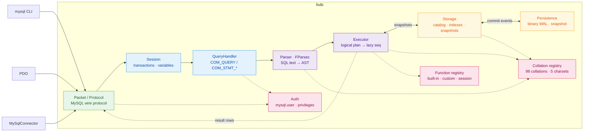

# fsdb

[](LICENSE)
[](global.json)
[](docs/compatibility.md)

A MySQL-compatible database server in idiomatic F#, speaking the MySQL wire
protocol so clients like `mysql`, PDO, and MySqlConnector work without a
custom adapter. An in-memory engine built as a pipeline: bytes → command →
AST → logical plan → lazy `seq`.

## Contents

- [Quick start](#quick-start)
- [How it works](#how-it-works)
- [SQL surface](#sql-surface)
- [Persistence format](#persistence-format)
- [Embedding & extensibility](#embedding--extensibility)
- [Benchmarking](#benchmarking)
- [Development](#development)
- [Documentation](#documentation)

## Quick start

Requires the .NET 10 SDK pinned by `global.json`. A MySQL client is needed for
the CLI walkthrough below; [`just`](https://github.com/casey/just) is optional
but provides the repository's standard commands.

```sh
dotnet run --project src/Fsdb        # listens on 127.0.0.1:3307
mysql --protocol=tcp -h127.0.0.1 -P3307 -uroot -e 'SELECT 1'
```

With `just`, the same two-terminal workflow is `just run` and `just client`.

Port 3307 avoids a real MySQL on 3306 (`--port` overrides). A `root` account
with all privileges and no password exists out of the box; accounts, `GRANT`s,
and passwords are managed with the usual `CREATE USER` / `GRANT` / `SET
PASSWORD` statements (mysql_native_password, verified at the handshake — a
passwordless account accepts only an empty password, same as MySQL). Account
locks, TLS requirements, explicit password expiry, and per-account resource
limits are enforced as well.

First queries:

```sql
CREATE DATABASE app;
USE app;
CREATE TABLE notes (id BIGINT AUTO_INCREMENT PRIMARY KEY, body TEXT);
INSERT INTO notes (body) VALUES ('hello fsdb');
SELECT * FROM notes;
```

Common MySQL clients connect without an fsdb-specific driver:

| Client | Connect |
|---|---|
| mysql CLI | `mysql --protocol=tcp -h127.0.0.1 -P3307 -uroot` |
| PDO (PHP) | `new PDO('mysql:host=127.0.0.1;port=3307;dbname=app', 'root', '')` |
| MySqlConnector (.NET) | `new MySqlConnection("Server=127.0.0.1;Port=3307;User ID=root;Database=app")` |

Install as a single self-contained binary (no .NET needed on the machine):

```sh
just install      # publishes to ~/.local/bin/fsdb, then: fsdb --help
```

```
USAGE: fsdb [--help] [--port <port>] [--listen <address>] [--data-dir <path>]
            [--defaults-file <path>] [--ssl-cert <path>] [--ssl-key <path>]
            [--require-secure-transport] [--version]

OPTIONS:

    --port, -p <port>     listen port (default 3307)
    --listen <address>    bind address (default 127.0.0.1)
    --data-dir <path>     persist trusted server state here (WAL + snapshots);
                          omit for in-memory
    --defaults-file <path>
                          read server settings from a my.cnf-style file's
                          [mysqld] section
    --ssl-cert <path>     PEM server certificate for TLS
    --ssl-key <path>      PEM private key for TLS
    --require-secure-transport
                          reject plaintext MySQL sessions
    --version             print the fsdb version and exit
    --help                display this list of options.
```

fsdb reads `/etc/my.cnf`, `/etc/mysql/my.cnf`, `$MYSQL_HOME/my.cnf`, and
`~/.my.cnf` when present. `--defaults-file` reads only the named file instead.
The parser follows MySQL's format rather than a generic ini dialect:
`[mysqld]`/`[server]` groups, mid-line `#`/`;` comments, quoted values with
escapes, `-` and `_` interchangeable, size suffixes, `!include`/`!includedir`,
and `loose-` for options fsdb doesn't have. Other groups are skipped, so a
shared my.cnf is safe to use; an unrecognised option inside `[mysqld]` is a
startup error naming the file and line, the same way mysqld refuses to start
on one.

```ini
[mysqld]
max_connections          = 2000
max_allowed_packet       = 64M
wait_timeout             = 600
net_read_timeout         = 30
innodb_lock_wait_timeout = 50
cte_max_recursion_depth  = 1000
loose-skip-name-resolve            # an option fsdb has no knob for
ssl-cert                 = /etc/fsdb/server-cert.pem
ssl-key                  = /etc/fsdb/server-key.pem
require-secure-transport = ON
```

Defaults-file settings apply at startup as process-wide defaults. The standard
files are auto-discovered unless `--defaults-file` selects one explicitly.
`max_connections`, `max_allowed_packet`,
`wait_timeout`, `net_read_timeout`, `innodb_lock_wait_timeout`, and
`cte_max_recursion_depth` can
also be changed with `SET GLOBAL`; see
[the compatibility guide](docs/compatibility.md) for the complete behavior and
deliberate divergences.

## How it works

One pipeline, all the way down:



### Parser

An FParsec combinator grammar parses SQL into a discriminated-union AST.
`SELECT`s compile to a logical plan that executes lazily: `LIMIT` stops the
scan once enough rows survive, and `ORDER BY ... LIMIT n` streams a bounded
top-(n+offset) set instead of materializing the full sort.

### Engine

Databases and tables live in a value-swapped catalog. Repeatable-read
transactions establish a snapshot on their first database statement;
read-committed transactions refresh from committed roots per statement;
read-uncommitted transactions additionally compose active private deltas into
that statement view. Writes remain private until commit under every isolation
level. Commit performs a row-level three-way merge: disjoint
concurrent changes combine, while indexed point/range UPDATE and DELETE
statements wait for an existing row owner and rebase before applying their
change. Remaining overlapping write shapes fail with MySQL's retryable 1205
error. Immutable row pages let the merge inspect only pages changed from the
transaction snapshot and maintain indexes incrementally.
`FOR UPDATE`, `FOR SHARE`, and `LOCK IN SHARE MODE` use current committed row
versions and retain shared or exclusive row-stripe ownership until transaction
end. `OF`, `NOWAIT`, and `SKIP LOCKED` follow MySQL's transaction behavior;
direct indexed single-table predicates narrow the locked rows, while joins and
scan-shaped locking reads conservatively lock each targeted physical source.
`LOCK TABLES` provides session-scoped shared/exclusive ownership with MySQL's
alias restrictions, temporary-table exception, atomic replacement lists, and
implicit locks for view and trigger dependencies. Ordinary statements acquire
compatible table ownership only for their execution, so explicit locks also
coordinate with sessions that never issue `LOCK TABLES`.
PK/UNIQUE and composite secondary equality lookups go through maps keyed by
the columns' collation-folded encodings, so `utf8mb4_0900_ai_ci` keys collide
exactly as MySQL's do. One-column literal `IN` lists and direct literal ranges
in single-table reads and writes can seek matching primary, unique, and
secondary B-trees and report `range` in `EXPLAIN`.
Compatible composite `ORDER BY` and `GROUP BY` operations can stream that
index when preceding keys are fixed, including `LIMIT`, `OFFSET`, and literal
bounds; right joins and unconstrained multi-key ordering remain scans. Equality
buckets and ordered entries are separate derived
structures, deliberately trading memory and write work for efficient equality
buckets and bounded range seeks. Equi-joins hash-join; everything else is a
scan, except a physical inner or left-join right side whose complete indexed
key is bound by the outer row.

### Collations & charsets

All 89 utf8mb4 collations MySQL 8.4 ships are registered — plus the legacy
`utf8mb3`/`latin1`/`ascii`/`binary` ones (`utf8_*` accepted as MySQL's
deprecated alias), 98 in all — each as a locale, fold level, and pad
attribute with ICU sort keys doing the work. Honored per-column and per
`SET collation_connection` in grouping, dedup, joins, and unique keys.
Charsets `utf8mb4`/`utf8mb3`/`latin1` (cp1252)/`ascii`/`binary` follow
MySQL's write-time semantics, with `CONVERT(x USING …)` and `_charset'…'`
introducers.

### Prepared statements

`COM_STMT_PREPARE`/`COM_STMT_EXECUTE` bind parameter `Value`s into the
parsed AST (`?` → `Placeholder` → `Lit`), so a bound value keeps its real
type for every statement the grammar parses; only the text-probed `SET`/
`SHOW` forms still re-splice literals.

## SQL surface

The grammar covers the core used by MySQL-backed applications: `SELECT` with
joins (`NATURAL`/`USING` included), derived tables, `GROUP BY`/`HAVING`, window
functions, `UNION [ALL]`, expression subqueries, ordinary and recursive CTEs
at top level and inside subqueries, derived tables, and INSERT/REPLACE sources,
JSON paths and `JSON_TABLE`, multi-table `UPDATE`/`DELETE`, `REPLACE`,
`EXPLAIN`, enforced and `NOT ENFORCED` `CHECK` constraints, typed user and
system variables in expressions, direct single-table updatable views,
view `WITH CHECK OPTION`,
`BEFORE`/`AFTER` triggers for `INSERT`/`UPDATE`/`DELETE` with compound bodies
and nested procedure calls, including multi-table UPDATE/DELETE targets, and
user accounts
with real `CREATE USER`/`GRANT`/`REVOKE` privilege enforcement.

The introspection surface GUI clients lean on is served with real data:
25 `information_schema` tables whose column sets are diffed against a live
MySQL 8.4, the `SHOW` family (`STATUS`, `VARIABLES`, `ENGINES`, `GRANTS`,
`CREATE TABLE`, ...), and a live `PROCESSLIST` with working
`KILL QUERY|CONNECTION`.

What makes the SQL surface *this* server's rather than generic SQL: every
comparison, sort, group, dedup, join, and unique key folds by the column's
own collation. `SET collation_connection` governs literals, so
`SELECT 'åge' = 'age' COLLATE utf8mb4_bin` is 0 while
`... COLLATE utf8mb4_0900_ai_ci` is 1. Charsets transcode on write;
`SHOW CREATE TABLE` reports declared collations and column comments, and
`information_schema.COLUMNS` carries `CHARACTER_SET_NAME`, `COLLATION_NAME`,
and `COLUMN_COMMENT`.

The deliberate gaps — including complex updatable views, the remaining stored
program language, replication, and every smaller divergence — are
documented in
[docs/compatibility.md](docs/compatibility.md) and marked `ponytail:` at
their code sites.

## Persistence format

`--data-dir` stores two files, both binary (no JSON). Durable mode currently
targets macOS and Linux because disk synchronization calls POSIX `fsync`
through libc.

The data directory is a trusted input with the same authority as the server
process. CRC-32 detects torn or accidentally corrupted records; it does not
authenticate them. Anyone who can modify `wal.bin` or `snapshot.fsdb` can
modify the catalog, including the `mysql.user` rows loaded at startup. Keep
the directory writable only by the account running fsdb.

**`wal.bin`** — one framed record per committed event:

```
[int32 LE payload length][uint32 LE CRC-32 of payload][payload bytes]
```

The payload is a `CommitEvent` in a tag-byte codec (schema DDL as
pre-encoded statement trees; row events as physical `Value[]`s, so replay
writes the exact committed values — `NOW()` replays to the same instant, not
a fresh one). A crash mid-append leaves a torn final record; replay stops
before it (length overrun or CRC mismatch), truncates the WAL back to the
last good offset, and the next append glues onto a clean boundary.
Replay locates keyed row changes through the table's unique indexes and
maintains derived indexes incrementally; keyless row-image events use one
ordered table pass.

Concurrent commits use a bounded group-commit queue. Commits that arrive
while a flush is in progress share the next append and `fsync`, while each
client is acknowledged only after that batch is durable. Snapshot rotation
passes through the same queue as a checkpoint barrier, so truncation cannot
overtake a published WAL event. The defaults-file setting
`wal_group_commit_queue_capacity` controls producer backpressure (default
1024).

**`snapshot.fsdb`** — the catalog as a self-delimiting binary tree
(`database count` → tables → rows), same tag-byte codec and row format as the
WAL. Written to `snapshot.fsdb.new`, fsynced via libc `fsync`, then renamed
into place; a `.new` that parses cleanly supersedes the WAL on startup, a
torn one falls back to the old snapshot plus full WAL replay. fsdb avoids
`FileStream.Flush(true)` because it issues the substantially stronger
`F_FULLFSYNC` on macOS; plain `fsync` matches MySQL's default macOS flush
semantics.

By default, the catalog is snapshotted and the WAL truncated once the WAL
crosses 64 MiB or 100,000 events, or during a graceful shutdown. The
`wal_rotate_bytes` and `wal_rotate_entries` defaults-file settings tune those
thresholds.

## Embedding & extensibility

Every function call — including built-ins like `CONCAT` and `JSON_EXTRACT` —
resolves through one registry, SQLite-style. Embed fsdb in your own program and
register a function before you start listening:

```fsharp
open Fsdb
open Fsdb.Value

let slug (s: string) =
    System.Text.RegularExpressions.Regex.Replace(s.ToLowerInvariant(), "[^a-z0-9]+", "-").Trim '-'

[<EntryPoint>]
let main _ =
    Db.create ()
    |> Db.registerScalar "slugify" (function
        | [ VString s ] -> VString(slug s)
        | _ -> VNull)
    |> Db.listen System.Net.IPAddress.Loopback 3307
    |> Async.RunSynchronously

    0
```

`Db.registerAggregate` works the same way for aggregate functions — the fold
receives every non-NULL row's value and returns one:

```fsharp
let median (values: Value list) =
    let sorted = values |> List.choose (function VInt i -> Some(float i) | _ -> None) |> List.sort

    match sorted with
    | [] -> VNull
    | _ ->
        let mid = sorted.Length / 2

        if sorted.Length % 2 = 0 then
            VDouble((sorted.[mid - 1] + sorted.[mid]) / 2.0)
        else
            VDouble sorted.[mid]

let db =
    Db.create ()
    |> Db.registerAggregate "MEDIAN" median
```

A custom function can override a built-in of the same name — the registry
doesn't distinguish "shipped with fsdb" from "registered by the embedder",
though session-bound functions like `DATABASE()` always shadow both:

```fsharp
// Deterministic timestamps for reproducible tests.
Db.create ()
|> Db.registerScalar "NOW" (fun _ -> VDateTime(System.DateTime(2026, 1, 1)))
```

`--data-dir` durability works the same way when embedding:

```fsharp
Db.create () |> Db.withDataDir "./fsdb-data" |> Db.listen System.Net.IPAddress.Loopback 3307
```

Embedding hosts enable TLS with an `X509Certificate2` that already contains
its private key:

```fsharp
Db.create ()
|> Db.withTlsCertificate certificate
|> Db.requireSecureTransport
|> Db.listen System.Net.IPAddress.Any 3307
```

`Db.withLogger` hooks a log sink in the same style. See
`tests/Fsdb.Tests/IntegrationTests.fs` for the full round-trip test
(`SLUGIFY`/`MEDIAN`) against a real client over the wire.

### The rich extension API

`registerScalar` is the sugar for context-free functions. A function that
calls the network (or needs to know who's asking) uses the rich form:

```fsharp
Db.create ()
|> Db.registerFunction (
    ScalarFunction.create "LLM_EMBED" (fun ctx args -> embed ctx.Cancellation args)
    |> ScalarFunction.effectful)
```

- **`QueryContext`** — what the function sees about the executing query:
  `Database` (current schema, matches `DATABASE()`), `User` (matches
  `CURRENT_USER()`), and `Cancellation`, the killed-client token — hand it
  to `HttpClient` so a network call stops when its client vanishes.
- **`ScalarFunction.create name fn`** builds the default shape:
  deterministic, callable anywhere. **`ScalarFunction.effectful`** is the
  network-calling shape in one word: non-deterministic plus direct-only.
  Direct-only functions are rejected inside generated-column definitions
  (SQLite's DIRECTONLY rationale: the engine — not the user's statement —
  would re-invoke them on every later write); the deterministic flag is
  carried metadata for host-side caches.
- **`SqlError`** — `raise (SqlError(1210, "no such model"))` reaches the
  client as exactly that code/message instead of the generic 1105
  catch-all. A throwing function still aborts the transaction like any
  other failure.
- **Arity is a pattern match**, not a registration parameter — one function
  handles all its shapes: `function [p] -> ... | [m; p] -> ... | _ -> raise ...`.
  Handle `VNull` arguments too: the executor type-checks expressions
  against an all-NULL probe row before touching real rows, so return
  `VNull` for NULL inputs like every builtin does.
- **Blocking, honestly**: there is no async executor. A scalar blocks its
  connection thread for as long as it runs — a slow HTTP call is a slow
  query, on that connection only.

`Db.registerTable` exposes host state as a read-only table in the reserved
`fsdb` schema, and `Db.onCommit` subscribes to the committed-write feed
(the same CDC feed the WAL rides, multi-subscriber):

```fsharp
db
|> Db.registerTable (
    VirtualTable.create "models" [ VirtualTable.text "name"; VirtualTable.text "endpoint" ] listModels)
|> Db.onCommit (fun event -> queue.Enqueue event)
```

The `onCommit` contract: handlers run synchronously under the commit lock,
so keep them fast, and never write back into the database from inside one —
re-entry deadlocks. Queue what you saw and act after the statement returns
(see the auto-embedding loop in the example below). Subscribe after
`withDataDir`, which replaces the store.

`Db.connect` opens an in-process connection (no socket — `USE`, variables,
and transactions persist across `Query` calls), and `Db.serve` starts a
stoppable wire server (`RunningServer.Port` matters when you pass port 0):

```fsharp
let conn = Db.connect db
conn.Query "SELECT * FROM fsdb.models" |> ignore

use running = db |> Db.serve System.Net.IPAddress.Loopback 0
printfn "listening on %d" running.Port
```

`examples/LlmSearch` puts all of it together — `llm_complete`/`llm_embed`
against any OpenAI-compatible endpoint (Ollama by default), a `fsdb.models`
virtual table, auto-embedding on insert via `onCommit`, and semantic search
with `ORDER BY DISTANCE(..., 'COSINE')`. Run it without a model server:

```sh
just example -- --dry-run
```

`examples/ReceiptPipeline` goes further: PDFs in, relational rows out, with
the work in SQL rather than host code. The host registers `ocr` (pdftotext)
and `llm_schema` (structured extraction), then six statements do the rest —
two cancellable batch `UPDATE`s, an `INSERT ... SELECT ... ON DUPLICATE KEY
UPDATE` vendor upsert, `INSERT IGNORE` against a unique key as the receipt
dedupe, and `JSON_TABLE` exploding `$.items[*]` into line-item rows. CHECK
constraints guard totals, confidence, quantities, prices, and queue states. A
live aggregate view reports vendor spend. Three `AFTER INSERT` audit triggers
feed an audit log, whose own trigger maintains an insert-only rollup and
exercises a two-level trigger chain.

```sh
just receipts -- --dry-run                       # offline fixtures
RECEIPT_ENDPOINT=https://api.openai.com/v1 \
RECEIPT_MODEL=gpt-5-mini RECEIPT_API_KEY=$OPENAI_API_KEY \
  just receipts -- --dump ~/receipts/*.pdf       # real PDFs, real model
```

Two things that example teaches the hard way. **Constrain formats in the
schema, not the prompt**: without a `"ISO 8601 YYYY-MM-DD"` description on
the date field, a live run returned `25/01/2026` for two receipts, which
doesn't coerce to `DATE` — and `INSERT IGNORE`, being both the dedupe and the
failure sink, dropped them silently. **Dedupe in two layers**: a `UNIQUE` sha
on the queue catches byte-identical resubmissions before spending an LLM
call, while the unique key on `receipts` catches the same receipt arriving as
different bytes. Keying dedupe solely on model output makes it only as stable
as the model.

## Benchmarking

`benchmarks/Fsdb.Benchmarks` runs fsdb head-to-head against a native MySQL
8.4, same schema, same seeded data, same queries, via BenchmarkDotNet.

```sh
just bench              # full latency suite, results -> benchmarks/results/<git-sha>.md
just bench-features     # recent SQL-feature latency subset
just bench-quick        # ShortRun job for fast local iteration, no results file
just bench-durable      # durability-matched: fsdb WAL vs MySQL fsync/no-fsync
just bench-scale        # latency suite at 100k users / 500k orders
just bench-load         # N-writer throughput under concurrency (ops/sec)
just bench-load-scale    # throughput at 1/2/4/8/16 workers
just bench-comprehensive # all latency, durability, scale, and load suites
```

Both servers start ad hoc (no brew services) and shut down after. fsdb
optimizes for readable, idiomatic F# over raw speed, so expect MySQL to win
most of these — the numbers track fsdb's hotspots, not parity.

## Development

Run the normal local gate before sending a change:

```sh
just check
```

That builds the root solution and runs the full Expecto suite. The `test`
recipe passes additional arguments through to Expecto, so one case can be run
by name:

```sh
just test --filter-test-case <Substring>
```

`just test-report` writes JUnit timings to `test-results/fsdb.xml`, and
`just stress [minutes]` runs Expecto's randomized stress mode with memory
headroom for the deliberate large-packet cases.

Coverage uses the repository-pinned Coverlet tool and fails if total branch
coverage falls below 65%:

```sh
just coverage
```

F# source order is explicit. When adding a `.fs` file, place its
`<Compile Include="..." />` entry in dependency order in the relevant project
file before any file that consumes it.

MySQL 8.4 is the semantic oracle. Compatibility changes should be checked
against MySQL rather than SQLite, then captured in the Expecto suite. The
differential harness under `torture/` is a separate solution and deliberately
is not part of `just check`; see the
[torture harness guide](torture/README.md) before running or changing it.

## Documentation

- [Compatibility](docs/compatibility.md) — how MySQL 8.4 equivalence is validated
- [Comment style](docs/comment-style.md) — the grading every comment survives
- [Torture harness](torture/README.md) — differential fuzzing against a MySQL 8.4 oracle
- [Benchmarks](benchmarks/README.md) — workloads and methodology
